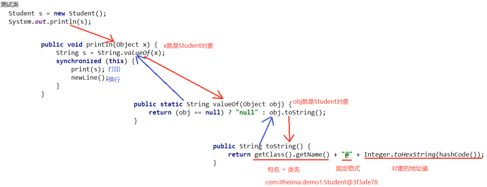

# 多态

## 1. 多态的前提条件

```java
问题：
        1.如果要实现多态，应该具备哪些条件？
        2.一种事物表现的多种形态在代码中，是指什么现象？
```

- 什么是多态
  - 同一个对象，在不同时刻表现出来的不同形态
- 多态的前提

  - 要有继承或实现关系
  - 要有方法的重写
  - 要有父类引用指向子类对象
- 代码演示

```java
/**
 * 需求一：在继承关系基础上，实现多态的效果
 *  1.创建一个父类Animal
 *      行为：
 *          吃饭eat()
 *  2.创建一个子类Dog，继承动物类
 *      重写行为：
 *          吃饭eat()：狗吃屎
 *  3.创建一个子类Cat，继承动物类
 *      重写行为：
 *          吃饭eat()：猫吃鱼
 *  4.在测试类中实现：
 *      声明两个变量animal1和animal2，都是动物类型
 *      分别给两个变量赋值为Dog对象和Cat对象
 *      分别调用两个对象的eat方法，观察效果
 */

```

```java
/**
 * 需求二：在实现关系基础上，实现多态的效果
 * 1.创建一个接口Inter
 *      行为：
 *          吃饭eat()：抽象方法
 *          喝水drink()：默认方法
 *              喝水
 *
 * 2.创建一个实现类Dog，实现接口Inter
 *      重写行为：
 *          吃饭eat()：狗吃屎
 *
 * 3.创建一个子类Cat，实现接口Inter
 *      重写行为：
 *          吃饭eat()：猫吃鱼
 *
 * 4.在测试类中实现：
 *      声明两个Inter接口类型的变量dog和cat，分别赋值Dog和Cat对象
 *      分别调用dog和cat的drink方法，观察效果
 *      再分调用dog和cat的eat方法，观察效果
 */

```

## 2. 多态中的成员访问特点

- 成员访问特点

  - 成员变量：编译看父类，运行看父类

  - 成员方法：编译看父类，运行看子类

  - 构造方法：同继承一样，子类会通过super访问父类构造方法

- 代码演示

```java
//视频案例
class Fu {
    int num = 10;
    public void method(){
        System.out.println("Fu.. method");
    }
}
class Zi extends Fu {
    int num = 20;
    public void method(){
        System.out.println("Zi.. method");
    }
}

public class Test2Polymorpic {
    /*
           多态的成员访问特点:
                  成员变量: 编译看左边 (父类), 运行看左边 (父类)
                  成员方法: 编译看左边 (父类), 运行看右边 (子类)
     */
    public static void main(String[] args) {
        Fu f = new Zi();
        System.out.println(f.num);
        f.method();
    }
}
```

## 3. 多态的好处和弊端

- 好处
  - 提高程序的扩展性。定义方法时候，使用父类型作为参数，在使用的时候，使用具体的子类型参与操作
- 弊端
  - 不能使用子类的特有成员

```java
/**
 * 练习一：
 *  1.创建父类Animal,提供eat抽象方法
 *  2.创建Cat类和Dog类，分别继承Animal类，重写自己的eat方法
 *  3.利用多态的格式，在测试类中增加使用Animal的方法，进行测试，查看效果
 */

```

```java
/**
 * 练习二：
 *    1.定义一个演员类Actor
 		   属性：姓名name
 *          行为：
 *              演戏act()：演员的工作是演戏
 *
 *    2.定义一个歌手类Singer
 		   属性：姓名name
 *          行为：
 *              唱歌sing()：歌手的工作是唱歌
 *
 *    3.有一个经济公司类BrokerageCompany
 *          属性：
 *              演员们：ArrayList<Actor> actors;
 *              歌星们：ArrayList<Singer> singers;
 *          行为：
 *              签约歌星：将歌星添加进集合
 					signSinger(Singer singer)
 *              签约演员：将演员添加进集合
 					signActor(Actor actor)
 *			   获取歌星：根据歌星姓名从集合中获取歌星对象
 					Singer getSinger(String name)
 *			   获取演员：根据演员姓名从集合中获取演员对象
 					Actor getActor(String name)
 *			   商演：演员和歌星分别调用演戏和唱歌方法
 *					businessShow(Actor actor)
 *					businessShow(Singer singer)
 *
 *    4.利用多态知识优化当前案例代码
 */

```

## 4. 多态中的转型

```java
问题：
        1.在多态关系中，父类引用能否调用子类特有的方法？
        2.什么情况下，需要在多态关系中进行向下转型？
```

- 向上转型

  - 父类引用指向子类对象就是向上转型

- 向下转型

  - 格式：子类型 对象名 = (子类型)父类引用;

- 代码演示

  ```java
  class Fu {
      public void show(){
          System.out.println("Fu..show...");
      }
  }
  
  class Zi extends Fu {
      @Override
      public void show() {
          System.out.println("Zi..show...");
      }
  
      public void method(){
          System.out.println("我是子类特有的方法, method");
      }
  }
  
  public class Test3Polymorpic {
      public static void main(String[] args) {
          // 1. 向上转型 : 父类引用指向子类对象
          Fu f = new Zi();
          f.show();
          // 多态的弊端: 不能调用子类特有的成员
          // f.method();
  
          // A: 直接创建子类对象
          // B: 向下转型
  
          // 2. 向下转型 : 从父类类型, 转换回子类类型
          Zi z = (Zi) f;
          z.method();
      }
  }
  ```

## 5. 多态中转型存在的风险和解决方案

+ 风险
  + 如果被转的引用类型变量,对应的实际类型和目标类型不是同一种类型,那么在转换的时候就会出现ClassCastException
+ 解决方案

  + 关键字：instanceof

  + 使用格式
    + 变量名 instanceof 类型
    + 通俗的理解：判断关键字左边的变量，是否是右边的类型，返回boolean类型结果
+ 代码演示

```java
abstract class Animal {
    public abstract void eat();
}

class Dog extends Animal {
    public void eat() {
        System.out.println("狗吃肉");
    }

    public void watchHome(){
        System.out.println("看家");
    }
}

class Cat extends Animal {
    public void eat() {
        System.out.println("猫吃鱼");
    }
}

public class Test4Polymorpic {
    public static void main(String[] args) {
        useAnimal(new Dog());
        useAnimal(new Cat());
    }

    public static void useAnimal(Animal a){  // Animal a = new Dog();
        								  // Animal a = new Cat();
        a.eat();
        //a.watchHome();
		
        //Dog dog = (Dog) a; // ClassCastException  类型转换异常
        //dog.watchHome();  

        // 判断a变量记录的类型, 是否是Dog
        if(a instanceof Dog){
            Dog dog = (Dog) a;
            dog.watchHome();
        }
    }
}
```

```java
/**
 * 练习：利用instanceof关键字，继续优化经纪公司案例
 */

```

# 内部类

## 1. 内部类：成员内部类

**内部类概念概述：**在一个类中定义一个类

**格式&举例：**

```java
/*
	格式：
    class 外部类名{
    	修饰符 class 内部类名{
    	
    	}
    }
*/

class Outer {
  public class Inner {

  }
}
```

**创建内部类对象的格式：**外部类名.内部类名 对象名 = new 外部类名().new 内部类名();

**内部类的访问特点：**

- 可以直接访问外部类的成员，包括私有
- 外部类访问内部类的成员，必须创建对象

**代码案例：**

```java
/**
* 1.练习创建内部类格式
* 2.在内部类中访问外部类成员
* 3.在其它类中创建内部类对象，调用内部类的方法和成员
*/
class Outer{
    public void method() {
        System.out.println("外部类的普通方法");
    }

    public static void method1() {
        System.out.println("外部类的静态方法");
    }

    private void method2() {
        System.out.println("外部类的私有方法");
    }
    //外部类的私有成员变量
    private int num2=20;
    
    class Inner{
        int num1 = 10;
        public void show(){
            System.out.println("Inner...show");
            //内部类中可以访问外部类的成员变量，包括私有
            System.out.println(num1 + "..." + num2);
            //内部类中可以访问外部类的成员方法，包括私有和静态
            method();
            method1();
            method2();
        }
    }
}

public class OutInnerTest{
    public static void main(String[] args){
        //创建内部类对象
        Outer.Inner in = new Outer().new Inner();
        in.show();
    }
}
```

**内部类的好处：**

- 外部类不能直接访问内部类的成员，提供了一个==更好的封装==

- 内部类提供了类多继承的可能性

```java
/**
 * 1.定义一个BaseCalculator类
 * 行为：
 * 加法：add(double a,double b)
 * 减法：sub(double a,double b)
 * 
 * 2.定义一个HighCalculator类
 * 行为：
 * 次幂乘法：pow(double a,int b)
 * 
 * 3.如果想要自己的MyCalculator类，同时具备这两个类的功能，利用内部类的知识，该如何处理？
 * 
 */

class MyCalc {
    //这就相当于自己有两个内部类把别人的代码功能给继承过来了
    class Inner1 extends BaseCalc {
    }

    class Inner2 extends HighCalc {
    }

    //这个时候我就可以去编写自己的加法和求次幂
    //加法功能
    public double add(double a, double b) {
        //创建内部类对象，调用内部类继承过来的加法
        Inner1 inner1 = new Inner1();
        return inner1.add(a, b);
    }

    //求次幂计算，第一个参数是底数，第二个是指数
    public double pow(double a, int b) {
        //在外部类中，也可以使用常规方式创建内部类对象
        Inner2 inner2 = new MyCalc().new Inner2();
        //调用内部类继承过来的求求次幂功能，返回结果
        return inner2.pow(a, b);
    }
}

class BaseCalc {
    //加法功能
    public double add(double a, double b) {
        return a + b;
    }
}

class HighCalc {
    //求次幂计算，第一个参数是底数，第二个是指数
    public double pow(double a, int b) {
        //sum代表最后的结果
        double sum = a;
        for (int i = 1; i < b; i++) {
            sum *= a;
        }
        return sum;
    }
}
```

- 内部类访问成员变量，访问顺序：
  - 先到内部类方法中的局部范围寻找
  - 再到内部类的成员位置寻找
  - 到外部类的成员位置寻找
  - 如果没找到，就报错
- 补充：
  - 如果内部类和外部类有==同名成员变量==，如何==访问外部类==的成员变量：==外部类名.this.成员变量==
  - 如果==内部类局部范围==有和==内部类成员范围==中相同的变量，如何==访问内部类==成员变量：==this.成员变量==

```java
class Outer {
    int num = 20;
    class Inner {
        int num = 10;
        public void show() {
            int num = 30;
            System.out.println("Inner...show");
            //内部类中访问内部类的成员变量
            System.out.println(num);
            //如果外部类有和内部类相同的成员变量
            //根据就近原则，先找本类有没有，有就直接打印
            //但是我想访问外部类的成员变量，怎么办？
            //指定外部类名，访问方式：外部类名.this.成员变量
            System.out.println(Outer.this.num);
            //发现this.成员变量也可以使用，它用的是谁呢？用的是内部类本类的成员
            System.out.println(this.num);
        }
    }
    public void method() {
        //在外部类的方法中，创建内部类对象，创建的格式正常了，可以直接创建
        Inner inner = new Inner();
        inner.show();
    }
}

public class TestInner {
    public static void main(String[] args) {
        Outer.Inner inner = new Outer().new Inner();
        inner.show();
        System.out.println("===========");
        //在一个其他类中创建内部类对象，调用内部类的方法
        //在其他类中创建外部类，调用外部类的方法
        Outer outer = new Outer();
        outer.method();
    }
}
```

**成员内部类：**按照内部类在类中定义的位置不同，可以分为如下两种形式：

- 在类的成员位置：成员内部类
- 在类的局部位置：局部内部类

## 2. 私有成员内部类&静态成员内部类

```java
问题：
        1.一个内部类的私有成员内部类，能否在外部类之外的地方直接访问？
        2.静态内部类的静态方法，有多少种访问方式？
```

- 成员内部类，也属于（成员），既然是成员就可以被一些修饰符所修饰

  - private
    - 私有成员内部类访问：在自己所在的外部类中创建对象访问

  - static
    - 静态成员内部类访问格式：外部类名.内部类名 对象名 = new 外部类名.内部类名();
    - 静态成员内部类中的静态方法：外部类名.内部类名.方法名();


- **私有成员内部类演示：**

```java
class Outer1 {
    private class Inner {
        public void show() {
            System.out.println("private...Inner...show");
        }
    }

    public void method() {
        //2.在外部类中创建私有内部类对象，调用其方法
        Inner inner = new Inner();
        inner.show();
    }
}

public class OutInnerTest1 {
    public static void main(String[] args) {
        // 1.常规创建内部类对象方式不适合私有成员内部类
        // Outer1.Inner in=new Outer1().new Inner();//编译报错
        Outer1 outer1 = new Outer1();
        outer1.method();
    }
}

```

- **静态成员内部类演示：**

```java
class Outer2 {
    static class Inner {
        public void show() {
            System.out.println("static...Inner...show");
        }
        public static void method() {
            System.out.println("static...Inner...static...method");
        }
    }
}
public class OutInnerTest2 {
    public static void main(String[] args) {
        //1. 外部类名.内部类名 对象名=new 外部类名.内部类名();
        Outer2.Inner inner = new Outer2.Inner();
        //2. 内部类对象调用静态内部类普通方法
        inner.show();
        //3. 内部类对象调用静态内部类静态方法
        inner.method();
        //4. 内部类名直接调用静态内部类静态方法
        Outer2.Inner.method();
    }
}
```

## 3. 局部内部类

```java
问题：
        1.能否在外界直接使用局部内部类？
        2.局部内部类能否访问到外部类的局部变量？
        3.学习局部内部类的原因是什么？
```

- 概述

  - 局部内部类是在方法中定义的类，所以外界是无法直接使用，需要在当前方法内部创建对象并使用

  - 该类可以直接访问外部类的成员，也可以访问方法内的局部变量

- 编写位置：方法中

- 访问方式：只能在方法中，创建对象并访问

```java
/**
 * 局部内部类的定义和访问
 */
class Outer3 {
    int a = 10;
	//外部类的方法
    public void method() {
        int b = 20;
        //1.局部内部列的定义位置在方法中
        class Inner {
            public void show() {
                System.out.println(a);
                System.out.println(b);
            }
        }
        //2.局部内部类只能在方法中访问
        Inner inner = new Inner();
        inner.show();
    }
}

public class OutInnerTest3 {
    public static void main(String[] args) {
        //3.普通内部类的访问方式无法访问局部内部类
        //Outer2.Inner inner = new Outer2().new Inner();
        //4.创建外部类对象调用方法，在方法内部访问局部内部类
        Outer3 outer3 = new Outer3();
        outer3.method();
    }
}
```

## 4. 匿名内部类

```java
问题：
        1.如果要创建一个匿名内部类，需要什么前提条件？
        2.使用匿名内部类有什么好处？
        3.匿名内部类对象需要用什么类型的变量去接收？
```

- 概述：匿名内部类本质上是一个特殊的局部内部类（**定义在方法内部**）

- 前提：需要存在一个接口或类

- 匿名内部类的理解：将继承\实现，方法重写，创建对象放在了一步进行

- 格式：

  ```java
  new 类名或接口名(){
      重写方法;
  }
  ```

- 范例：

  ```java
  new Inter(){
      public void show(){
          System.out.println("匿名内部类中的show方法");
      }
  }.show();
  
  interface Inter{
      void show();
  }
  ```

- **代码练习：**

```java
//1.创建一个接口，分别定义eat和sleep方法
//2.在测试类中使用匿名内部类的方式调用这两个方法
interface Inter{
    public void eat();

    public void sleep();
}

public class Test03 {
    public static void main(String[] args) {
        //1.有了匿名内部类的使用前提，开始创建匿名内部类对象
        new Inter() {

            @Override
            public void eat() {
                System.out.println("吃饭");
            }

            @Override
            public void sleep() {
                System.out.println("和女人睡觉");
            }
        }.sleep();
        //这种方式，创建了对象之后马上调用方法，对象并没有用变量保存，用完就没有了
        //2.创建匿名内部类对象，使用多态的形式，保存对象
        Inter in = new Inter(){
            @Override
            public void eat() {
                System.out.println("吃饭");
            }

            @Override
            public void sleep() {
                System.out.println("和女人睡觉");
            }
        };
        //使用接口类型的变量，调用方法，并且可以多次调用
        in.sleep();
        in.eat();
    }
}
```

## 5. 匿名内部类的使用场景

当方法的形式参数是接口或抽象类时，可以将匿名内部类作为实际参数进行传递

```java
interface Inter{
    public void swimming();
}

public class Test04 {
    public static void main(String[] args) {
        //当一个方法的形式参数是接口类型，就可以使用匿名内部类的形式调用
        useMethod(new Inter() {
            @Override
            public void swimming() {
                System.out.println("男人游泳，一定要带泳镜");
            }
        });
        //使用匿名内部类，让类的功能更加灵活
    }

    public static void useMethod(Inter in) {
        //不要忘记调用接口的方法
        in.swimming();
    }
}
```

# 常用API

## 1. Object

### 1.1 Object：toString

- Object类概述

  - Object 是类层次结构的根，每个类都可以将 Object 作为超类。所有类都直接或者间接的继承自该类，换句话说，该类所具备的方法，所有类都会有一份
- 查看方法源码的方式

  - 选中方法，按下Ctrl + B
- println()方法打印对象的原码分析



- 重写toString方法的方式

  - Alt + Insert 选择toString
  - 在类的空白区域，右键 -> Generate -> 选择toString
- toString方法的作用：

  - 以良好的格式，更方便的展示对象中的属性值

```java
//课后练习：创建一个Person类，有姓名、年龄、性别三个属性，按照JavaBean的标准流程补全所有内容，并合理重写toString方法。然后在测试类中创建对象，测试打印对象

```

### 1.2 Object：equals

```java
问题：
        1.Object类中的equals方法，底层是使用什么方式进行比较？
        2.利用Idea提供的给一个类自动生成equals方法，内部是如何判断两个对象相同的？
```

- equals方法的作用

  - 用于对象之间的比较，返回true和false的结果
  - 举例：s1.equals(s2); s1和s2是两个对象

- 重写equals方法的场景

  - 不希望比较对象的地址值，想要结合对象属性进行比较的时候。

- 重写equals方法的方式

  -
    1. alt + insert 选择equals() and hashCode()，IntelliJ Default，一路next，finish即可
  -
    1. 在类的空白区域，右键 -> Generate -> 选择equals() and hashCode()，后面的同上。

- 示例代码：

  ```java
  //课后练习：给Person类‘自动’生成equals方法，然后在测试类中创建两个对象进行比较
  
  ```

### 1.3 Object：面试题

```java
// 看程序,分析结果
String s="abc";
        StringBuilder sb=new StringBuilder("abc");
        s.equals(sb);
        sb.equals(s);
```

## 2. Objects

```java
问题：
        1.调用Objects的两个参数的toString方法，如果传入的对象是null值，会返回什么结果？
        2.两个参数的toString方法，在源代码中的原理是什么？
```

+ 常用方法

  | 方法名                                          | 说明                             |
          | ----------------------------------------------- | -------------------------------- |
  | public static String toString(对象)             | 返回参数中对象的字符串表示形式。 |
  | public static String toString(对象, 默认字符串) | 返回对象的字符串表示形式。       |
  | public static Boolean isNull(对象)              | 判断对象是否为空                 |
  | public static Boolean nonNull(对象)             | 判断对象是否不为空               |

+ 示例代码

学生类

```java
//自定义一个Student类，重写toString方法、equals方法
//在测试类中比较两个Student对象是否相同
//使用Objects的各个api方法，测试看看效果，加深印象
public class Student {
    private int age;
    private String name;
    private String face;

    public Student() {
    }

    public Student(int age, String name, String face) {
        this.age = age;
        this.name = name;
        this.face = face;
    }

    public String getName() {
        return name;
    }

    public void setName(String name) {
        this.name = name;
    }

    public String getFace() {
        return face;
    }

    public void setFace(String face) {
        this.face = face;
    }

    public int getAge() {
        return age;
    }

    public void setAge(int age) {
        this.age = age;
    }

    @Override
    public String toString() {
        return "Student{" +
            "age=" + age +
            ", name='" + name + '\'' +
            ", face='" + face + '\'' +
            '}';
    }
}
```

测试类

```java
//练习：在测试类中创建Student对象，并分别用四种方法测试看看效果
public class Test01 {
    public static void main(String[] args) {
        Student stu = new Student(18, "李小璐", "肤白貌美大长腿，前凸后翘樱桃嘴");
        //调用的是toString方法，但是这个方法会返回一个字符串，而不是打印字符串
        Objects.toString(stu); 
        System.out.println(Objects.toString(stu, "查无此人"));
        System.out.println(Objects.toString(null, "查无此人"));
    }
}
```

## 3. Math

```java
问题：
        1.Math类没有构造方法，如何使用类中的成员呢？
        2.Math中的向上取整和向下取整分别是什么方法？
        3.Math中获取两个数的最大值和最小值的方法是什么？
```

- Math类概述

  - Math 包含执行基本数字运算的方法

- Math中方法的调用方式

  - Math类中无构造方法，但内部的方法都是静态的，则可以通过   **类名.进行调用**

- Math类的常用方法

  | 方法名 方法名                               | 说明                                           |
          | ---------------------------------------------- | ---------------------------------------------- |
  | public static int   abs(int a)                 | 返回参数的绝对值                               |
  | public static double ceil(double a)            | 返回大于或等于参数的最小double值，等于一个整数 |
  | public static double floor(double a)           | 返回小于或等于参数的最大double值，等于一个整数 |
  | public   static int round(float a)             | 按照四舍五入返回最接近参数的int                |
  | public static int   max(int a,int b)           | 返回两个int值中的较大值                        |
  | public   static int min(int a,int b)           | 返回两个int值中的较小值                        |
  | public   static double pow (double a,double b) | 返回a的b次幂的值                               |
  | public   static double random()                | 返回值为double的正值，[0.0,1.0)                |

```java
//课后练习：在测试类中，分别使用Math的各个常用方法，获取对应结果，在控制台打印观察

```

## 4. System

```java
问题：
        1.利用Idea在java中搜索一个类的快捷键是什么？
        2.System和Math在API文档中没有构造方法介绍的原因是什么？
```

- System类的常用方法

  | 方法名                                                       | 说明                                             |
          | ------------------------------------------------------------ | ------------------------------------------------ |
  | public   static void exit(int status)                        | 终止当前运行的 Java 虚拟机，非零表示异常终止 |
  | public   static long currentTimeMillis()                     | 返回当前时间(以毫秒为单位)                       |
  | arraycopy(数据源数组, 起始索引, 目标数组, 起始索引, 拷贝个数) | 数组复制                                         |

- 示例代码

  - 需求：打印10000次，范围是[0,10)的随机数的平方值。并计算这段逻辑需要耗时多久

  ```java
  
  ```

  - 需求：有一个存储8个整数的数组，将该数组中第3、4、5、6个元素拷贝到另外一个数组中，并打印在控制台上

  ```java
  public class Test {
      public static void main(String[] args) {
          //1.分析需求，知道这是操作数组，想到了System的arrayCopy方法
          //2.提供材料
          int[] srcArr = {1, 2, 3, 4, 5, 6, 7};
          //目标数组
          int[] descArr = new int[5];
          //3.开始复制，使用提供好的工具方法
          System.arraycopy(srcArr,2,descArr,0,4);
          for (int i = 0; i < descArr.length; i++) {
              System.out.print(descArr[i]+" ");
          }
      }
  }
  ```

## 5. BigDecimal

### 5.1 BigDecimal：构造

```java
问题：
        1.为什么浮点数运用于计算的时候，数据结果会不准确？
        2.BigDecimal常用的构造方法有几种，分别传入什么类型的参数？
```

+ 构造方法

  | 方法名                 | 说明         |
          | ---------------------- | ------------ |
  | BigDecimal(double val) | 参数为double |
  | BigDecimal(String val) | 参数为String |

### 5.2 BigDecimal：四则运算

```java
问题：
        1.使用BigDecimal对象进行运算时，能否直接用BigDecimal对象使用运算表达式进行计算？
        2.如果使用的是浮点数的构造创建的BigDecimal对象，进行运算时会有什么问题？
```

- 作用：可以用来进行精确计算

+ 常用方法

  | 方法名                                            | 说明 |
          | ------------------------------------------------- | ---- |
  | public BigDecimal add(另一个BigDecimal对象)       | 加法 |
  | public BigDecimal subtract (另一个BigDecimal对象) | 减法 |
  | public BigDecimal multiply (另一个BigDecimal对象) | 乘法 |
  | public BigDecimal divide (另一个BigDecimal对象)   | 除法 |

+ 总结

  1. BigDecimal是用来进行精确计算的
  2. 创建BigDecimal的对象，构造方法使用参数类型为字符串的。

```java
//练习：使用BigDecimal分别创建两个对象，然后在测试类中调用加减乘除的方法，打印结果
//1.创建两个BigDecimal对象，去根据api进行方法验证
BigDecimal b1 = new BigDecimal("0.1");
BigDecimal b2 = new BigDecimal("0.2");

//加法
//2.验证api
BigDecimal b3 = b1.add(b2);
//3.可以直接打印BigDecimal对象，不会出现地址值，说明这个类重写了toString方法
System.out.println(b3);

//减法

//乘法

//除法

```

### 5.3 BigDecimal：特殊方法

```java
问题：
        1.使用BigDecimal的divide(BigDecimal b)方法做除不尽的运算会出现什么问题？
        2.什么是BigDecimal的舍入模式，有什么作用？
        3.舍入模式中，哪些比较常用，分别是什么？
```

| 方法名                                                       | 说明 |
| ------------------------------------------------------------ | ---- |
| public BigDecimal divide (另一个BigDecimal对象，精确几位，舍入模式) | 除法 |

- 四则运算中的除法，如果除不尽请使用divide的三个参数的方法
- 常用的舍入模式：
  - 进一法：BigDecimal.ROUND_UP
  - 去尾法：BigDecimal.ROUND_FLOOR
  - 四舍五入：BigDecimal.ROUND_HALF_UP

代码示例：

```java
//练习：利用三种舍入模式，使用BigDecimal进行计算

```

