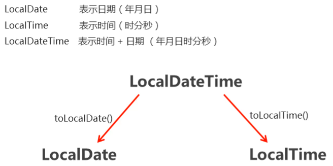
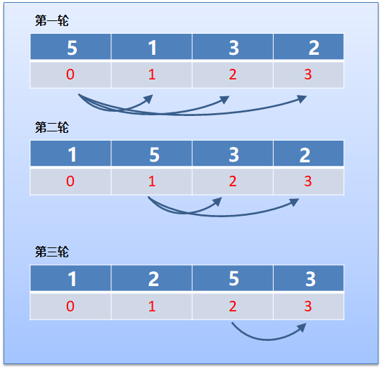
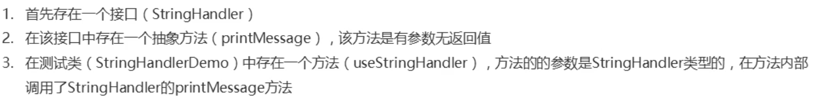
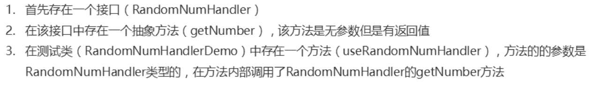
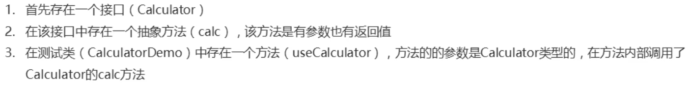

# 日期与时间

## 1. 时间日期类：概述

```java
问题：
1.计算机中的起始时间是从什么时候开始的？
2.北京时间和世界标准时间的关系是怎样的？
```


+ 计算机中时间原点
  + 1970年1月1日 00:00:00
+ 时间换算单位
  + 1秒 = 1000毫秒
+ 北京时间需要在世界标准时间上加8小时

```java
/**
 * 练习：利用System.currentTimeMillis()方法计算：
 * 1.当前时间已经距离计算机时间原点经过了多少年多少月
 * 2.例如：2021年10月10日距离计算机时间原点已过了51年9个月
 */

```


## 2. Date

### 2.1 Date类概述和构造方法

```java
问题：
1.创建Date的对象，选择哪个包底下的Date类？
2.使用Date的空参构造创建的对象，代表的默认时间是什么时间？
3.当使用Date的带参构造传入0L，获取的时间为什么不是计算机时间原点？
```


+ Date类概述

  + Date 代表了一个特定的时间，精确到毫秒

+ Date类构造方法

  | 方法名                    | 说明                                  |
  | ---------------------- | ----------------------------------- |
  | public Date()          | 分配一个 Date对象，并初始化，以便它代表它被分配的时间，精确到毫秒 |
  | public Date(long date) | 分配一个 Date对象，并将其初始化为表示从标准基准时间起指定的毫秒数 |

+ 示例代码

```java
public class DateDemo01 {
    public static void main(String[] args) {
      //public Date()：分配一个 Date对象，并初始化，以便它代表它被分配的时间，精确到毫秒
        Date d1 = new Date();
        System.out.println(d1);

      /* 
      public Date(long date)：分配一个 Date对象，
      并将其初始化为表示从标准基准时间起指定的毫秒数
      */
        long date = 1000*60*60;
        Date d2 = new Date(date);
        System.out.println(d2);
    }
}
```

```java
/**
 * 练习：创建一个时间日期类对象，代表系统当前时间三天后的时间，打印在控制台上
 */

//1.获取系统当前时间的毫秒值
long now = System.currentTimeMillis();
//2.要获取三天后的时间，你得先计算出三天的毫秒值
long millis = 1000 * 60 * 60 * 24 * 3 + now;
//得出的毫秒值是三天后的时间距离时间原点经过的毫秒值
//3.获取时间日期类，选择有参构造，传入这个毫秒值
Date date = new Date(millis);
System.out.println(date);
```


### 2.1 Date类常用方法

- 常用方法

  | 方法名                            | 说明                                 |
  | ------------------------------ | ---------------------------------- |
  | public long getTime()          | 获取的是日期对象从1970年1月1日 00:00:00到现在的毫秒值 |
  | public void setTime(long time) | 设置时间，给的是毫秒值                        |

- 示例代码

```java
public class DateDemo02 {
    public static void main(String[] args) {
        //创建日期对象
        Date d = new Date(0);
        //public long getTime():获取的是日期对象从1970年1月1日 00:00:00到现在的毫秒值
        //System.out.println(d.getTime());
        //System.out.println(d.getTime() * 1.0 / 1000 / 60 / 60 / 24 / 365 + "年");
        //public void setTime(long time):设置时间，给的是毫秒值
        //long time = 1000*60*60;
        long time1 = System.currentTimeMillis();
        d.setTime(time1);
        System.out.println(d);
        System.out.println("================================");
        //1.利用空参创建一个时间对象
        Date d1 = new Date();
        //Date类重写了toString方法
        System.out.println(d1);
        d1.setTime(0L);
        System.out.println(d1);
        //2.用有参构造创建了时间对象
        Date d2 = new Date(3600L * 1000);
        long time2 = d2.getTime();
        System.out.println(time2);
        Date d3 = new Date();
        long time3 = d3.getTime();
        System.out.println(time3);
    }
}
```


## 3. SimpleDateFormat类

```java
问题：
1.学习SimpleDateFormat的原因是什么？
2.用来代表年、月、日的字母分别是什么？
3.SimpleDateFormat的格式化和解析的区别是什么？
4.在解析字符串为日期时，如果字符串和给出的解析规则不一致会怎样？
```


- SimpleDateFormat类概述

  - SimpleDateFormat可以对Date对象，进行==格式化和解析==

- 常见的模式字母及对应关系如下：

  - y	  年
  - M       月
  - d        日
  - H        时
  - m       分
  - s         秒

- SimpleDateFormat类构造方法

  | 方法名                                    | 说明                                                   |
  | ----------------------------------------- | ------------------------------------------------------ |
  | public   SimpleDateFormat()               | 构造一个SimpleDateFormat，使用默认模式和日期格式       |
  | public   SimpleDateFormat(String pattern) | 构造一个SimpleDateFormat使用给定的模式和默认的日期格式 |

- SimpleDateFormat类的常用方法

  - 格式化（从Date到String）
    - public final String format(Date date)：将日期格式化成日期/时间字符串
  - 解析（从String到Date）
    - public Date parse(String source)：从给定字符串的开始解析文本以生成日期

- 示例代码

```java
//格式化：Date——>String
//1.创建一个日期对象
Date d = new Date();
//SimpleDateFormat sdf = new SimpleDateFormat();
//2.创建一个日期模板对象，给定一个模板：2021年6月18日 10:21:00
SimpleDateFormat sdf = new SimpleDateFormat("yyyy年MM月dd日 HH:mm:ss");
//3.将日期对象中的日期信息，按照模板解析成一个特定的字符串
String s = sdf.format(d);
//4.将格式化之后的日期字符串打印出来
System.out.println(s);

System.out.println("--------------------");

//解析：String——>Date
//5.给定一个有时间信息的字符串，但是java只认为他是字符串
String ss = "2048-08-09 11:11:11";
//6.要将这个字符串转换成java认识的时间，就需要解析，还得和字符串有同样的模板，只是替换时间的部分
SimpleDateFormat sdf2 = new SimpleDateFormat("yyyy-MM-dd HH:mm:ss");
//7.按照特定模板创建了日期格式化对象之后，开始对字符串进行解析，得到日期对象
//8.此处代码会爆红，alt+回车，选择第一个
Date dd = sdf2.parse(ss);//ParseException
System.out.println(dd);
```


```java
/**
 * 课后练习：分析以下需求，并用代码实现
 * 1.从键盘录入一个日期字符串,格式为 xxxx-xx-xx,代表该人的出生日期
 * 2.利用人出生日期到当前日期所经过的毫秒值计算出这个人活了多少天
 */
//1.获取键盘录入对象，录入字符串
Scanner sc = new Scanner(System.in);
System.out.println("亲，请输入您的生日哦：");
String strBirth = sc.next();
//2.要把字符串转换成Date，字符串没有日期的属性，只有Date有日期的相关属性
//3.获取SimpleDateFormat类对象
SimpleDateFormat sdf = new SimpleDateFormat("yyyy-MM-dd");
//4.拿到了工具，开始进行转换
Date date = sdf.parse(strBirth);
//已经拿到了出生日期，要计算活了几天
//5.先获取出生日期对应的毫秒值
long birth = date.getTime();
//6.怎么拿到活了多少天？用系统现在的毫秒值减去出生日期的毫秒值，就得到了
long daymillis = System.currentTimeMillis() - birth;
//7.把毫秒转换成天
System.out.println("活了" + daymillis / 1000 / 60 / 60 / 24 + "天");
```


- 练习

  + 需求
    + 秒杀开始时间是2020年11月11日 00:00:00，结束时间是2020年11月11日 00:10:00
    + 用户小贾下单时间是2020年11月11日 00:03:47
    + 用户小皮下单时间是2020年11月11日 00:10:11
    + 判断用户有没有成功参与秒杀活动

  + 实现步骤

    - 判断下单时间是否在开始到结束的范围内

  - 把字符串形式的时间变成毫秒值

  + 代码实现


```java
//1.定义秒杀活动的开始和结束时间字符串
String start = "2020年11月11日 00:00:00";
String end = "2020年11月11日 00:10:00";
//2.定义小贾和小皮的下单时间
String jia = "2020年11月11日 00:03:47";
String pi = "2020年11月11日 00:10:11";
//3.判断用户下单时间是否在开始和结束中间，那就需要判断大小，可是字符串本身是没有数字含义的，无法做计算
//4.既然字符串没有计算功能，日期有没有呢？日期也不能直接计算？进一步思考，日期的毫秒值可以计算
//5.字符串不能直接转换成毫秒值，因为字符串没有日期的属性，那就先把字符串转换成日期
//6.创建日期格式化对象SimpleDateFormat
SimpleDateFormat sdf = new SimpleDateFormat("yyyy年MM月dd日 HH:mm:ss");
//7.开始转换成日期对象，但是还是不能计算，得获取毫秒值，用getTime方法
long startTime = sdf.parse(start).getTime();
long endTime = sdf.parse(end).getTime();

//8.将下单时间也转换成毫秒值
long jiaTime = sdf.parse(jia).getTime();
long piTime = sdf.parse(pi).getTime();

//9有了可以计算的毫秒值，可以开始判断
if (jiaTime >= startTime && jiaTime <= endTime) {
    System.out.println("小贾参与了秒杀活动");
} else {
    System.out.println("很可惜，小贾错过了壹佰亿");
}

if (piTime >= startTime && piTime <= endTime) {
    System.out.println("小皮参与了秒杀活动");
} else {
    System.out.println("很可惜，小皮错过了壹佰亿");
}
```


## 3. Calendar日历类

1. 概述：Calendar类是一个==抽象类==，用于表示日历。可以用它来更好的处理日期和时间。日历类的纪年方法采取的就是公历纪年
2. 获取日历类对象
   - Calendar是一个抽象类，所以没有办法使用构造方法得到它的实例化对象。但是可以获取它的子类对象
   - Calendar本身提供了一个==静态的==`getInstance()`方法，可以用来获取它的实现类对象
3. 常用属性

| 类型       | 字段               | 描述                                   |
| ---------- | ------------------ | -------------------------------------- |
| static int | YEAR               | 年份                                   |
| static int | MONTH              | 月份，从0开始                          |
| static int | DATE，DAY_OF_MONTH | 当月的日期                             |
| static int | HOUR_OF_DAY        | 小时，24小时制                         |
| static int | HOUR               | 小时，12小时制                         |
| static int | MINUTE             | 分钟                                   |
| static int | SECOND             | 秒                                     |
| static int | MILLISECOND        | 毫秒                                   |
| static int | DAY_OF_WEEK        | 星期，从周日（1）开始，到周六（7）结束 |

4. 常用方法

| 方法名                                                       | 返回值类型 | 描述                                                         |
| :----------------------------------------------------------- | :--------- | :----------------------------------------------------------- |
| getTime()                                                    | Date       | 返回一个 `Date`对象，表示此 `Calendar`的时间值               |
| setTime(Date date)                                           | void       | 使用给定的 `Date`设置此日历的时间                            |
| add(int field, int amount)                                   | void       | 根据日历的规则，为给定的日历字段添加或减去指定d的时间量      |
| roll(int field, int amount)                                  | void       | 与add方法类似，区别在于加上amount后超过了该字段所能表示的最大范围时，也不会向上一个字段进位 |
| get(int field)                                               | int        | 返回给定日历字段的值                                         |
| set(int field, int value)                                    | void       | 将给定的日历字段设置为给定值                                 |
| set(int year, int month, int date)                           | void       | 设置Calendar对象的年、月、日三个字段的值                     |
| set(int year, int month,  int date, int hourOfDay, int minute, int second) | void       | 设置Calendar对象的年、月、日、时、分、秒6个字段的值          |

4. 代码练习

```java
/**
 * 练习一：
 * 1.使用日历类对象，获取系统当前的年、月、日，并打印在控制台上
 * 2.分别设置年、月、日、时、分、秒为：2020-05-20 13:14:20
 * 3.将Calendar的年前推一年
 * 4.将Calendar的月前推8个月
 */

//1.获取系统当前时间对应的日历对象
Calendar calendar = Calendar.getInstance();
//2.根据日历对象获取当前的年、月、日
int year = calendar.get(Calendar.YEAR);
int month = calendar.get(Calendar.MONTH);
int date = calendar.get(Calendar.DATE);
System.out.println("当前的时间是：" + year + "年" + (month + 1) + "月" + date + "日");
//3.利用日历类提供的方法设置对应时间:2020-05-20 13:14:20
calendar.set(2020, 05, 20, 13, 14, 20);
//4.打印设置后的时间
System.out.println(calendar.getTime());
//5.Calendar的年前推一年
calendar.add(Calendar.YEAR, -1);
//打印设置后的年
System.out.println(calendar.get(Calendar.YEAR));
//6.将Calendar的月前推8个月
calendar.add(Calendar.MONTH, -8);
//打印设置后的月
System.out.println(calendar.get(Calendar.MONTH));
```

```java
/**
 * 练习二：分别使用Date和SimpleDateFormat以及日历类两种方式实现以下需求
 * 1.已知日期字符串:"2015-10-20",将日期字符串转换为日期对象
 * 2.根据日期对象获取日期是星期几,以及是这一年的第几天
 * 3.通过键盘录入日期字符串，格式(2015-10-20)
 * 例如输入：2015-10-20，输出"2015年10月20日是星期二，是2015年的第293天"
 */
//1.获取键盘录入对象，录入日期
Scanner sc = new Scanner(System.in);
System.out.println("请输入日期：");
String dateStr = sc.next();
//2.把字符串转换成Date对象，创建SimpleDateFormat对象
SimpleDateFormat sdf = new SimpleDateFormat("yyyy-MM-dd");
//3.将字符串转换成Date
Date date = sdf.parse(dateStr);
//4.需求是得到这个日期的星期数，天数
//5.创建日历类对象
Calendar calendar = Calendar.getInstance();
//6.将得到的日期设置给日历
calendar.setTime(date);
//7.日历拥有了日期的信息，就可以获取这些信息
int year = calendar.get(Calendar.YEAR);
//月份是从0开始，所以要加1
int month = calendar.get(Calendar.MONTH) + 1;
int day = calendar.get(Calendar.DAY_OF_MONTH);
//获取星期，外国人星期是从周日（1）开始，要得到中国人的习惯，就得减1
int dayOfWeek = calendar.get(Calendar.DAY_OF_WEEK) - 1;
int dayOfYear = calendar.get(Calendar.DAY_OF_YEAR);
System.out.println(year + "年" + month + "月" + day + "日是星期" + dayOfWeek + "，是" + year + "年的第" + dayOfYear + "天");

System.out.println("===============================");
//第二种方式，更换一个模板即可
sdf = new SimpleDateFormat("yyyy年MM月dd日是E，是yyyy年的第D天");
//日期对象已经有了，直接转换成字符串
String str = sdf.format(date);
System.out.println(str);
```


# JDK8新增日期类

## 1. 获取时间对象

- 介绍

  + LocalDate：表示日期（年月日）  

  + LocalTime：表示时间（时分秒）

  + LocalDateTime：表示时间+ 日期 （年月日时分秒）

- **LocalDateTime创建方法：**

  + 方法说明

    | 方法名                                                  | 说明                                              |
    | ------------------------------------------------------- | ------------------------------------------------- |
    | public static LocalDateTime now()                       | 获取当前系统时间                                  |
    | public static LocalDateTime of(年, 月 , 日, 时, 分, 秒) | 使用指定年月日和时分秒初始化一个LocalDateTime对象 |


  + 示例代码

    ```java
    public class JDK8DateDemo2 {
        public static void main(String[] args) {
            //1.获取系统当前时间，类似于new Date();
            LocalDateTime now = LocalDateTime.now();
            //2.得到的是一个更加精确的时间，秒后面还有小数
            System.out.println(now);
            //3.获取指定时间，类似于 new Date(毫秒值);
            LocalDateTime localDateTime = LocalDateTime.of(2020, 11, 11, 11, 11, 11);
            System.out.println(localDateTime);
        }
    }
    ```


## 2. 获取时间中的每个值

**LocalDateTime获取方法**

+ 方法说明

  | 方法名                             | 说明               |
  | ------------------------------- | ---------------- |
  | public int getYear()            | 获取年              |
  | public int getMonthValue()      | 获取月份（1-12）       |
  | public int getDayOfMonth()      | 获取月份中的第几天（1-31）  |
  | public int getDayOfYear()       | 获取一年中的第几天（1-366） |
  | public DayOfWeek getDayOfWeek() | 获取星期             |
  | public int getMinute()          | 获取分钟             |
  | public int getHour()            | 获取小时             |

+ 示例代码

```java
public class JDK8DateDemo3 {
    public static void main(String[] args) {
        LocalDateTime localDateTime = LocalDateTime.of(2020, 11, 11, 11, 11, 20);
        //public int getYear()           //获取年
        int year = localDateTime.getYear();
        System.out.println("年为" +year);
        //public int getMonthValue()     //获取月份（1-12）
        int month = localDateTime.getMonthValue();
        System.out.println("月份为" + month);

        Month month1 = localDateTime.getMonth();
        //System.out.println(month1);

        //public int getDayOfMonth()     //获取月份中的第几天（1-31）
        int day = localDateTime.getDayOfMonth();
        System.out.println("日期为" + day);

        //public int getDayOfYear()      //获取一年中的第几天（1-366）
        int dayOfYear = localDateTime.getDayOfYear();
        System.out.println("这是一年中的第" + dayOfYear + "天");

        //public DayOfWeek getDayOfWeek() //获取星期
        DayOfWeek dayOfWeek = localDateTime.getDayOfWeek();
        System.out.println("星期为" + dayOfWeek);

        //public int getMinute()  //获取分钟
        int minute = localDateTime.getMinute();
        System.out.println("分钟为" + minute);
        //public int getHour()    //获取小时

        int hour = localDateTime.getHour();
        System.out.println("小时为" + hour);
    }
}
```


## 3. 转换方法


+ 方法说明

  | 方法名                              | 说明                |
  | -------------------------------- | ----------------- |
  | public LocalDate  toLocalDate () | 转换成为一个LocalDate对象 |
  | public LocalTime toLocalTime ()  | 转换成为一个LocalTime对象 |

+ 示例代码

```java
public class JDK8DateDemo4 {
    public static void main(String[] args) {
        LocalDateTime localDateTime = LocalDateTime.of(2020, 12, 12, 8, 10, 12);
        //public LocalDate toLocalDate ()    //转换成为一个LocalDate对象
        LocalDate localDate = localDateTime.toLocalDate();
        System.out.println(localDate);

        //public LocalTime toLocalTime ()    //转换成为一个LocalTime对象
        LocalTime localTime = localDateTime.toLocalTime();
        System.out.println(localTime);
    }
}
```


## 4. 格式化和解析

```java
问题：
1.如果直接打印LocalDateTime对象，打印的时间格式是否友好？
2.JDK8的日期格式化器是使用哪个类？
3.JDK8的日期格式化器调用哪个方法指定日期格式？
```


**LocalDateTime格式化和解析：**

| 方法名                                                  | 说明                                          |
| ------------------------------------------------------- | --------------------------------------------- |
| public String format (指定格式)                         | 把一个LocalDateTime格式化成为一个字符串       |
| public LocalDateTime parse (准备解析的字符串, 解析格式) | 把一个日期字符串解析成为一个LocalDateTime对象 |

- JDK8的日期格式化器（DateTimeFormatter）：

| 方法名                                                    | 说明                                                        |
| --------------------------------------------------------- | ----------------------------------------------------------- |
| public static DateTimeFormatter ofPattern(String pattern) | 使用指定的日期模板获取一个日期格式化器DateTimeFormatter对象 |

+ 示例代码

```java
public static void main(String[] args) throws ParseException {
    /*public static LocalDateTime parse (准备解析的字符串, 解析格式)
         把一个日期字符串解析成为一个LocalDateTime对象*/
    //1.给一个被解析的字符串
    String s = "2020年11月12日 13:14:15";
    //3.去创建一个格式化器
    DateTimeFormatter pattern = DateTimeFormatter.ofPattern("yyyy年MM月dd日 HH:mm:ss");
    //2.尝试解析，但是发现要给一个字符串，还需要一个格式化器
    LocalDateTime parse = LocalDateTime.parse(s, pattern);
    //4.打印验证
    System.out.println(parse);
}

//日期到字符串
public static void method1() {
    //1.创建日期对象
    LocalDateTime localDateTime = LocalDateTime.of(2020, 11, 12, 13, 14, 15);
    System.out.println(localDateTime);
    /*public String format (指定格式)   把一个LocalDateTime格式化成为一个字符串*/
    //3.开始创建格式化器对象，定义模板的方法是静态方法
    DateTimeFormatter pattern = DateTimeFormatter.ofPattern("yyyy年MM月dd日 HH:mm:ss");
    //2.开始格式化日期对象，这个时候发现参数要你给DateTimeFormatter对象，意识到这个就是格式化器
    String s = localDateTime.format(pattern);
    System.out.println(s);
}
```


## 5. plus系列的方法

```java
问题：
1.LocalDateTime对象调用plus系列方法增加时间，原对象代表时间有变化吗？
2.增加或减少时间都是同一个方法，如果要减去时间，参数应该传递什么值？
```


**LocalDateTime增加或者减少时间的方法：**

+ 方法说明

  | 方法名                                      | 说明      |
  | ---------------------------------------- | ------- |
  | public LocalDateTime plusYears (long years) | 添加或者减去年 |
  | public LocalDateTime plusMonths(long months) | 添加或者减去月 |
  | public LocalDateTime plusDays(long days) | 添加或者减去日 |
  | public LocalDateTime plusHours(long hours) | 添加或者减去时 |
  | public LocalDateTime plusMinutes(long minutes) | 添加或者减去分 |
  | public LocalDateTime plusSeconds(long seconds) | 添加或者减去秒 |
  | public LocalDateTime plusWeeks(long weeks) | 添加或者减去周 |

+ 示例代码

  ```java
  /**
   * JDK8 时间类添加或者减去时间的方法
   */
  public class JDK8DateDemo6 {
      public static void main(String[] args) {
          //public LocalDateTime plusYears (long years)   添加或者减去年
  
          LocalDateTime localDateTime = LocalDateTime.of(2020, 11, 11, 13, 14, 15);
          //LocalDateTime newLocalDateTime = localDateTime.plusYears(1);
          //System.out.println(newLocalDateTime);
  
          LocalDateTime newLocalDateTime = localDateTime.plusYears(-1);
          System.out.println(newLocalDateTime);
      }
  }
  ```


## 6. minus系列的方法

**LocalDateTime减少或者增加时间的方法：**

+ 方法说明

  | 方法名                                      | 说明      |
  | ---------------------------------------- | ------- |
  | public LocalDateTime  minusYears (long years) | 减去或者添加年 |
  | public LocalDateTime  minusMonths(long months) | 减去或者添加月 |
  | public LocalDateTime minusDays(long days) | 减去或者添加日 |
  | public LocalDateTime minusHours(long hours) | 减去或者添加时 |
  | public LocalDateTime minusMinutes(long minutes) | 减去或者添加分 |
  | public LocalDateTime minusSeconds(long seconds) | 减去或者添加秒 |
  | public LocalDateTime minusWeeks(long weeks) | 减去或者添加周 |

+ 示例代码

  ```java
  /**
   * JDK8 时间类减少或者添加时间的方法
   */
  public class JDK8DateDemo7 {
      public static void main(String[] args) {
          //public LocalDateTime minusYears (long years)  减去或者添加年
          LocalDateTime localDateTime = LocalDateTime.of(2020, 11, 11, 13, 14, 15);
          //LocalDateTime newLocalDateTime = localDateTime.minusYears(1);
          //System.out.println(newLocalDateTime);
  
          LocalDateTime newLocalDateTime = localDateTime.minusYears(-1);
          System.out.println(newLocalDateTime);
  
      }
  }
  ```


## 7. with系列的方法

```jav
问题：
1.如果在调用方法修改时间时，给出的参数超出了范围会怎样？
2.学了这么多操作时间的方法，记不住怎么办？
```


**LocalDateTime修改方法：**

+ 方法说明

  | 方法名                                      | 说明               |
  | ---------------------------------------- | ---------------- |
  | public LocalDateTime withYear(int year)  | 直接修改年            |
  | public LocalDateTime withMonth(int month) | 直接修改月            |
  | public LocalDateTime withDayOfMonth(int dayofmonth) | 直接修改日期(一个月中的第几天) |
  | public LocalDateTime withDayOfYear(int dayOfYear) | 直接修改日期(一年中的第几天)  |
  | public LocalDateTime withHour(int hour)  | 直接修改小时           |
  | public LocalDateTime withMinute(int minute) | 直接修改分钟           |
  | public LocalDateTime withSecond(int second) | 直接修改秒            |

+ 示例代码

  ```java
  /**
   * JDK8 时间类修改时间
   */
  public class JDK8DateDemo8 {
      public static void main(String[] args) {
          //public LocalDateTime withYear(int year)   修改年
          LocalDateTime localDateTime = LocalDateTime.of(2020, 11, 11, 13, 14, 15);
          // LocalDateTime newLocalDateTime = localDateTime.withYear(2048);
          // System.out.println(newLocalDateTime);
		
          LocalDateTime newLocalDateTime = localDateTime.withMonth(20);
          System.out.println(newLocalDateTime);
  
      }
  }
  ```


## 8. 时间间隔对象

```java
问题：
1.直接打印的Period对象，打印的结果表达的是什么意思？
2.在调用Duration类的between方法时，方法可以传入什么类型？
3.如果想要看两个时间间隔的毫秒，还需要让Duration对象调用什么方法？
```


**Period：**两个时间间隔的对象，精确到天

+ 方法说明

  | 方法名                                          | 说明                 |
  | ----------------------------------------------- | -------------------- |
  | public static Period between(开始时间,结束时间) | 计算两个“时间"的间隔 |
  | public int getYears()                           | 获得这段时间的年数   |
  | public int getMonths()                          | 获得此期间的月数     |
  | public int getDays()                            | 获得此期间的天数     |
  | public long toTotalMonths()                     | 获取此期间的总月数   |

+ 示例代码

  ```java
  /**
   *  计算两个时间的间隔
   */
  public class JDK8DateDemo9 {
      public static void main(String[] args) {
          //public static Period between(开始时间,结束时间) //计算两个"时间"的间隔
  
          LocalDate localDate1 = LocalDate.of(2020, 1, 1);
          LocalDate localDate2 = LocalDate.of(2048, 12, 12);
          Period period = Period.between(localDate1, localDate2);
          System.out.println(period);//P28Y11M11D
  
          //public int getYears()    //获得这段时间的年数
          System.out.println(period.getYears());//28
          //public int getMonths()   //获得此期间的月数
          System.out.println(period.getMonths());//11
          //public int getDays()     //获得此期间的天数
          System.out.println(period.getDays());//11
  
          //public long toTotalMonths()   //获取此期间的总月数
          System.out.println(period.toTotalMonths());//347
    }
  }
  ```


**Duration：**两个时间间隔对象，精确到纳秒

+ 方法说明

  | 方法名                                            | 说明                 |
  | ------------------------------------------------- | -------------------- |
  | public static Duration between(开始时间,结束时间) | 计算两个“时间"的间隔 |
  | public long toSeconds()                           | 获得此时间间隔的秒   |
  | public int toMillis()                             | 获得此时间间隔的毫秒 |
  | public int toNanos()                              | 获得此时间间隔的纳秒 |

+ 示例代码

  ```java
  /**
   *  计算两个时间的间隔
   */
  public class JDK8DateDemo10 {
      public static void main(String[] args) {
          //public static Duration between(开始时间,结束时间)  计算两个“时间"的间隔
  
          LocalDateTime localDateTime1 = LocalDateTime.of(2020, 1, 1, 13, 14, 15);
          LocalDateTime localDateTime2 = LocalDateTime.of(2020, 1, 2, 11, 12, 13);
          Duration duration = Duration.between(localDateTime1, localDateTime2);
          System.out.println(duration);//PT21H57M58S
          //public long toSeconds()	 //获得此时间间隔的秒
          System.out.println(duration.toSeconds());//79078
          //public int toMillis()	     //获得此时间间隔的毫秒
          System.out.println(duration.toMillis());//79078000
          //public int toNanos()       //获得此时间间隔的纳秒
          System.out.println(duration.toNanos());//79078000000000
      }
  }
  ```


## 9. 小结




**总结：**

1. 操作时间的功能：
   1. 表达时间
   2. 格式化和解析时间
   3. 修改时间
2. 有2套方案：
   1. Date+SimpleDateFormat+Calendar
   2. LocalDateTime(LocalDate、LocalTime)+DateTimeFormatter+时间间隔（Duration+Period）
3. 推荐使用第二套方案：
   1. 时间类功能更加强大和集中，弱化了格式化器的功能，让他更加专一，参与逻辑的结构就会更加简洁
   2. 日期类更改时间的方法调用更加直观和方便
   3. 比第一套方案多了时间间隔的功能


# 包装类

### 1. 基本类型包装类

```java
问题：
1.学习基本类型包装类有什么作用？
2.对于基本类型包装类的使用，最常用的操作是什么？
```


- 基本类型包装类的概述

  将基本数据类型封装成对象的好处在于可以在对象中定义更多的功能方法操作该数据

  常用的操作之一：用于基本数据类型与字符串之间的转换

- 基本类型对应的包装类

  | 基本数据类型 | 包装类    |
  | ------------ | --------- |
  | byte         | Byte      |
  | short        | Short     |
  | int          | Integer   |
  | long         | Long      |
  | float        | Float     |
  | double       | Double    |
  | char         | Character |
  | boolean      | Boolean   |


### 2. Integer：获得对象

```java
问题：
1.Integer的构造方法可以接收哪些类型的参数？
2.Integer的构造方法目前已经被哪些方法替代？
```


- Integer类概述

  包装一个对象中的原始类型 int 的值

- Integer类构造方法

  | 方法名                                  | 说明                                     |
  | --------------------------------------- | ---------------------------------------- |
  | public Integer(int   value)             | 根据 int 值创建 Integer 对象(过时)       |
  | public Integer(String s)                | 根据 String 值创建 Integer 对象(过时)    |
  | public static Integer valueOf(int i)    | 返回表示指定的 int 值的 Integer   实例   |
  | public static Integer valueOf(String s) | 返回一个保存指定值的 Integer 对象 String |

- 示例代码

  ```java
  public class IntegerDemo {
      public static void main(String[] args) {
          //public Integer(int value)：根据 int 值创建 Integer 对象(过时)
          Integer i1 = new Integer(100);
          System.out.println(i1);
  
          //public Integer(String s)：根据 String 值创建 Integer 对象(过时)
          Integer i2 = new Integer("100");
  	    //Integer i2 = new Integer("abc"); //NumberFormatException
          System.out.println(i2);
          System.out.println("--------");
  
          //public static Integer valueOf(int i)：返回表示指定的 int 值的 Integer 实例
          Integer i3 = Integer.valueOf(100);
          System.out.println(i3);
  
          //public static Integer valueOf(String s)：返回一个保存指定值的Integer对象 String
          Integer i4 = Integer.valueOf("100");
          System.out.println(i4);
      }
  }
  ```


### 3. 自动拆箱和自动装箱

```java
问题：
1.能不能在不调用构造方法或者静态方法的前提下，创建Integer对象？
2.自动装箱功能，java底层默认调用什么方法？
3.能否把Integer对象直接赋值给一个int类型的变量？
4.在使用包装类类型的时候，需要注意什么问题？
```


- 自动装箱

  ​	把基本数据类型转换为对应的包装类类型

- 自动拆箱

  ​	把包装类类型转换为对应的基本数据类型

- 注意事项：在使用包装类类型的时候，如果做操作，最好先判断是否为null

- 代码练习：

  ```java
  //给Integer类型变量赋值一个整数
  Integer i=100;
  //定义一个int类型的变量，将已经定义的Integer类型变量赋值给它
  int num=i;
  //使用Integer类型的变量进行加法运算
  System.out.println(i+3);
  i+=3;
  //i+=3 ——> i=i+3 ——> i自动拆箱和3相加，得到基本数据类型结果 ——> 基本数据类型自动装箱
  System.out.println(i);
  ```


### 4. Integer：类型转换

- int转换为String

  - 转换方式

    - 方式一：直接在数字后加一个空字符串
    - 方式二：通过String类静态方法valueOf()

  - 示例代码

    ```java
    public class IntegerDemo {
        public static void main(String[] args) {
            //int --- String
            int number = 100;
            //方式1
            String s1 = number + "";
            System.out.println(s1);
            //方式2
            //public static String valueOf(int i)
            String s2 = String.valueOf(number);
            System.out.println(s2);
            System.out.println("--------");
        }
    }
    ```

- String转换为int

  - 转换方式

    - 方式一：先将字符串数字转成Integer，再调用valueOf()方法
    - 方式二：通过Integer静态方法parseInt()进行转换

  - 示例代码

    ```java
    public class IntegerDemo {
        public static void main(String[] args) {
            //String --- int
            String s = "100";
            //方式1：String --- Integer --- int
            Integer i = Integer.valueOf(s);
            //public int intValue()
            int x = i.intValue();
            System.out.println(x);
            //方式2
            //public static int parseInt(String s)
            int y = Integer.parseInt(s);
            System.out.println(y);
        }
    }
    ```


### 5. 案例：字符串中数据的处理

- 案例需求

  有一个字符串：“91 27 46 38 50”，把其中的每一个数存到int类型的数组中

- 代码思路

  - 定义一个字符串
  - 把字符串中的数字数据存储到一个int类型的数组中
    - 两个难点：
      - 如何获取到里面的每一个值
      - 如何把每一个值编程int类型在存入数组
  - 遍历数组输出结果

- 代码实现

```java
public class Test {
    public static void main(String[] args) {
        //1.定义一个字符串，作为材料
        String s = "91 27 46 38 50";
        //2.把这个字符串切割成字符串数组，使用split方法，根据" "切割
        String[] strs = s.split(" ");
        //3.要创建一个int类型数组，长度和字符串数组一致
        int[] numArr = new int[strs.length];
        //4.把字符串数字从字符串数组中取出来转换成数字，再存到int数组中
        //遍历字符串数组
        for (int i = 0; i < strs.length; i++) {
            String strNum = strs[i];
            //把字符串转换成int数字
            int num = Integer.parseInt(strNum);
            numArr[i] = num;
        }
        //遍历int数组，看一下
        for (int i = 0; i < numArr.length; i++) {
            System.out.print(numArr[i]+" ");
        }
    }
}
```


# 正则表达式

## 1. 概述

- 作用
  - 正则表达式可以用一些规定的字符来制定规则，并用来校验数据格式的合法性
- 初体验
  - 需求：假如现在要求校验一个qq号码是否正确，6位及20位之内，必须全部是数字 
  - 要求：先使用目前所学知识完成校验需求；然后体验一下正则表达式检验
- 代码案例

```java
public class Demo {
    public static void main(String[] args) {
        /**
         * 正则表达式的作用：可以用一些规定的字符来制定规则，并用来校验数据格式的合法性
         * 需求：现在要求校验一个qq号码是否正确，6位及20位之内，必须全部是数字
         */
        //checkQQPrevious("23a234234");
        checkQQRegular("232234234");
    }

    //1.使用已有知识解决
    public static void checkQQPrevious(String qq) {
        //1.1 判断qq号长度是否合法
        int length = qq.length();
        if (qq == null || length <= 6 || length >= 20) {
            System.out.println("非法");
            return;
        }
        //1.2 检查qq号内容是否都是数字，遍历字符串
        for (int i = 0; i < qq.length(); i++) {
            //1.3 获取索引i对应的字符串中的字符
            char c = qq.charAt(i);
            //1.4 判断字符c是否不在编码表中'0'字符到'9'字符之间
            //有任意一个不是，则整个qq号都是非法的
            if (c < '0' || c > '9') {
                System.out.println("非法");
                return;
            }
        }
        //1.5 如果到此时方法还未结束，则证明QQ号合法
        System.out.println("合法");
    }

    //2.使用正则表达式解决
    public static void checkQQRegular(String qq) {
        if (qq != null && qq.matches("\\d{6,20}")) {
            System.out.println("合法");
        } else {
            System.out.println("非法");
        }
    }
}

```


## 2. 匹配规则

- 字符类
  - `[abc]`：只能是a, b, 或c
  - `[^abc]`：除了a, b, c之外的任何字符
  - `[a-zA-Z]`：a到z A到Z，包括（范围）
  - `[a-d[m-p]]`：a到d，或m到p
  - `[a-z&&[def]]`：d, e, 或f(交集)
  - `[a-z&&[^bc]]`：a到z，除了b和c，等同于`[ad-z]`
- 预定义的字符类（默认匹配一个字符）
  - `.`：任何字符
  - `\d`：一个数字，等同于 `[0-9]`
  - `\D`：非数字，等同于 `[^0-9]`
  - `\s`：一个空白字符，等同于` [ \t\n\x0B\f\r]`
  - `\S`：非空白字符，等同于` [^\s]`
  - `\w`：英文、数字、下划线，等同于`[a-zA-Z_0-9]`
  - `\W`：一个非单词字符，等同于`[^\w]`

- 贪婪的量词（配合匹配多个字符）
  - `X?`：X , 一次或根本不
  - `X*`：X，零次或多次
  - `X+`：X , 一次或多次
  - `X {n}`：X，正好n次
  - `X {n, }`：X，至少n次
  - `X {n,m}`：X，至少n但不超过m次
- 字符串对象提供了匹配正则表达式规则的API
  - boolean matches([String](file:///D:/course/%E5%9F%BA%E7%A1%80%E9%98%B6%E6%AE%B5/API%E6%96%87%E6%A1%A3/docs/api/java.base/java/lang/String.html) regex)：判断是否匹配正则表达式，匹配返回true，不匹配返回false
    - System.out.println("a".matches("[abc]"));      // true
    - System.out.println("z".matches("[abc]"));      // false
    - System.out.println("ab".matches("[abc]"));   // false
    - System.out.println("ab".matches("[abc]+")); // true


## 3. 常见案例

- 需求
  - 请编写程序模拟用户输入手机号码、验证格式正确，并给出提示，直到格式输入正确为止
  - 请编写程序模拟用户输入邮箱号码、验证格式正确，并给出提示，直到格式输入正确为止
  - 请编写程序模拟用户输入电话号码、验证格式正确，并给出提示，直到格式输入正确为止
- 分析
  - 定义方法，接收用户输入的数据，使用正则表达式完成检验，并给出提示
- 代码

```java
//案例：手机号、邮箱、电话验证
public class Demo {
    public static void main(String[] args) {
        /**
         * 请编写程序模拟用户输入手机号码、验证格式正确，并给出提示，直到格式输入正确为止
         * 格式：第1个数只能是1，第2个数可以是3、4、5、8。其余数字随意
         *
         * 请编写程序模拟用户输入邮箱号码、验证格式正确，并给出提示，直到格式输入正确为止
         * 格式：
         * @符号前：可以是数字和英文，最少1个，最多20个
         * @符号后：.符号前后都只能是英文字母，最少1个，最多10个
         *
         * 请编写程序模拟用户输入电话号码、验证格式正确，并给出提示，直到格式输入正确为止
         * 格式：区号-电话号；区号：3位数字；电话号7~10位
         */
        //1.创建Scanner键盘录入对象
        Scanner sc = new Scanner(System.in);
        String telPhone;
        //2.循环录入手机号
        while (true) {
            System.out.println("请输入手机号：");
            telPhone = sc.next();
            //2.1 判断手机号字符串是否合法
            //要求：第1个数只能是1，第2个数可以是3、4、5、8。其余数字随意
            if (telPhone.matches("1[3458]\\d{9}")) {
                //2.2 如果合法，结束循环
                break;
            } else {
                //不合法，提示
                System.out.println("输入有误，请重试！");
            }
        }

        //3.录入邮箱
        String email;
        while (true) {
            System.out.println("请输入邮箱：");
            email = sc.next();
            //3.1 判断邮箱字符串是否合法
            if (email.matches("[0-9a-zA-Z]{1,20}@[a-zA-Z]{1,10}\\.[a-zA-Z]{1,10}")) {
                //3.2 如果合法，结束循环
                break;
            } else {
                //不合法，提示
                System.out.println("输入有误，请重试！");
            }
        }

        //4.录入电话
        String phone;
        while (true) {
            System.out.println("请输入电话：");
            phone = sc.next();
            //4.1 判断电话字符串是否合法
            if (phone.matches("\\d{3}-\\d{7,10}")) {
                //4.2 如果合法，结束循环
                break;
            } else {
                //不合法，提示
                System.out.println("输入有误，请重试！");
            }
        }
        System.out.println("--------个人信息--------");
        System.out.println("手机号：" + telPhone);
        System.out.println("邮箱：" + email);
        System.out.println("座机：" + phone);
    }
}
```


## 4. 在String方法中的运用

- API

|                    方法名                     |                            说明                            |
| :-------------------------------------------: | :--------------------------------------------------------: |
| String replaceAll(String regex,String newStr) |              按照正则表达式匹配的内容进行替换              |
|         String[] split(String regex)          | 按照正则表达式匹配的内容进行分割字符串，反回一个字符串数组 |

- 代码

```java
//目标：掌握字符串中涉及正则表达式的方法的使用
public class Demo {
    public static void main(String[] args) {        
        //1.现有字符串："我2爱3J3a.v9a"，要求把里面不需要的内容替换掉，变成字符串"我 爱 J a v a"
        //1.1 要实现字符串的替换功能，用到replaceAll方法
        //1.2 确定不要的字符串，利用正则匹配出来
        String regex = "[\\d\\.]";
        //1.3 开始替换
        String s = "我2爱3J3a.v9a".replaceAll(regex, " ");
        System.out.println(s);
        
        //2.现有字符串："张三,男,23"，要求提取里面的学生数据，打印到控制台
        //切割字符串，使用split方法
        String[] strs = "张三,男,23".split(",");
        System.out.println("姓名：" + strs[0]);
        System.out.println("性别：" + strs[1]);
        System.out.println("年龄：" + strs[2]);
    }
}
```


# Arrays类

## 1. 常用功能

- 作用
  - 专门用于操作数组元素
- 常用API

|                  方法名                   |                       说明                       |
| :---------------------------------------: | :----------------------------------------------: |
|     static String toString(类型[] a)      |   返回数组的字符串表现形式，用来打印数组内容的   |
|        static void sort(类型[] a)         |              对数组进行默认升序排序              |
| static int binarySearch(int[] a, int key) | 二分搜索数组中的数据，存在返回索引，不存在返回-1 |


## 2. 指定规则排序

- 指定规则排序API

|                         方法名                          |           说明           |
| :-----------------------------------------------------: | :----------------------: |
| static <T> void sort(类型[] a, Comparator<? super T> c) | 使用比较器对象自定义排序 |

- Comparator比较器
  - java.util包下的接口，用于制定排序的比较规则
  - 重写compare方法，在方法内完成比较规则的指定
    - 如果返回值为负数，表示当前存入的元素是较小值，存左边
    - 如果返回值为0，表示当前存入的元素跟集合中元素重复了，不存
    - 如果返回值为正数，表示当前存入的元素是较大值，存右边

```java
//目标：掌握自定义比较器去定义数组的排序规则
public class Demo {
    public static void main(String[] args) {
        //需求：现有数组{44,11,55,22,33}，要求降序排列，打印数组内容
        //1.定义数组
        Integer[] arr = {44, 11, 55, 22, 33};
        //2.对数组进行排序，使用sort方法，但是不能用单个参数的，那是升序。
        //所以得使用sort的重载方法，第一个参数是需要排序的数组，第二个参数是用来定义排序规则的比较器对象
        //<>中规定数组中的数据类型，但只能是引用数据类型。并且数组也得是引用数据类型的数组
        Arrays.sort(arr, new Comparator<Integer>() {
            //3.只需要重写compare方法，这个方法就是用来指定排序规则的
            @Override
            public int compare(Integer o1, Integer o2) {
                //4.看看o1和o2分别是什么
                /*
                System.out.println("o1:" + o1);
                System.out.println("o2:" + o2);
                System.out.println("-----------");
                */
                //5.如果想知道升序还是降序，把两个数的位置换一下，运行看看既可以！
                return o1 - o2;
            }
        });
        //6.打印数组
        System.out.println(Arrays.toString(arr));
    }
}
```


# 常见算法

## 1. 选择排序

- 思想
  - 每轮选择当前位置，开始找出后面的较小值与该位置交换
- 关键
  - 确定总共需要选择几轮： 数组的长度-1
  - 控制每轮从以前位置为基准，与后面元素选择几次



- 代码

```java
//目标：掌握选择排序的使用
public class Demo {
    public static void main(String[] args) {
        /**
         * 规则：每轮选择当前位置，开始找出后面的较小值与该位置交换
         * 需求：现有数组{44,11,55,22,33}，要求使用选择排序对数组进行排序
         */
        //1.定义数组
        int[] arr = {44, 11, 55, 22, 33};
        //2.开始排序，首先要用for循环控制轮数，轮数：数组长度减1
        for (int i = 0; i < arr.length - 1; i++) {
            //3.每一轮有比较的次数，从当前选择的数的后面一个开始，到数组结束
            //当前选择的数的索引是i
            for (int j = i + 1; j < arr.length; j++) {
                //4.开始比较：拿当前选择的数：arr[i]，依次和后面的数比较，后面的数是：arr[j]
                if (arr[i] > arr[j]) {
                    //5.如果成立，后面的数比arr[i]小，就交换位置
                    //使用第三方变量
                    int temp = arr[i];
                    arr[i] = arr[j];
                    arr[j] = temp;
                }
            }
        }
        //6.打印数组，使用Arrays
        System.out.println(Arrays.toString(arr));
    }
}
```


## 2. 二分查找

```java
问题：
1.在数组中的元素满足什么条件的时候，就可以使用二分查找？
2.使用二分查找可以提高效率的原因是什么？
3.使用二分查找，在什么情况下就可以判断查找的元素不存在？
```


+ 二分查找概述
  + 查找指定元素在数组中的位置时，以前的方式是通过遍历，逐个获取每个元素，看是否是要查找的元素，这种方式当数组元素较多时，查找的效率很低
  + 二分查找也叫折半查找，每次可以去掉一半的查找范围，从而提高查找的效率


+ 需求

    + 在数组{1,2,3,4,5,6,7,8,9,10}中,查找某个元素的位置


+ 实现步骤

  1. 定义两个变量，表示要查找的范围。默认min = 0 ，max = 最大索引
  2. 循环查找，但是min <= max
  3. 计算出mid的值
  4. 判断mid位置的元素是否为要查找的元素，如果是直接返回对应索引
  5. 如果要查找的值在mid的左半边，那么min值不变，max = mid -1。继续下次循环查找
  6. 如果要查找的值在mid的右半边，那么max值不变，min = mid + 1。继续下次循环查找
  7. 当min > max 时，表示要查找的元素在数组中不存在，返回-1.

+ 代码实现

  ```java
  public class MyBinarySearchDemo {
      public static void main(String[] args) {
          //1.准备数组和要查找的范围以及要查找的元素
          int[] arr={1,2,3,4,5,6,7,8,9,10};
          int num = 11;
          int min = 0;
          int max = arr.length - 1;
          int index = -1;
          //2.开始查找，不知道找多少次，使用while循环。min<=max的时候循环查找
          while (min <= max) {
              //3.二分查找，要找中间的数，所以要把中间的索引mid求出来，(min+max)/2
              int mid = (min + max) / 2;
              //4.获取mid对应的元素，和要查找的元素比较
              //4.1 mid对应的元素大了，在左边，所以右边的边界max左移。max=mid-1
              if (arr[mid] > num) {
                  max = mid - 1;
              } else if (arr[mid] < num) {
                  //4.2 小了，在右边，左边的边界min右移。min=mid+1
                  min = mid + 1;
              } else {
                  //4.3 相等，找到了。记录索引值，并且结束循环
                  index = mid;
                  break;
              }
          }
          System.out.println(index);
      }
  }
  ```

+ 注意事项


  + 有一个前提条件，数组内的元素一定要按照大小顺序排列，如果没有大小顺序，是不能使用二分查找法的


# Lambda表达式

## 1. 初体验和函数式编程思想

```java
问题：
1.使用Lambda表达式优化有什么好处？
2.函数式编程思想和面向对象思想有什么区别？
```


1. Lambda初体验

   看一段代码：

```java
interface Swimming{
    void swim();
}

public class LambdaDemo{
    public static void main(String[] args){
        goSwimming(new Swimming(){
            @Override
            public void swim(){
                    System.out.println("老铁，我们去游泳吧~~~");
            }
        });
    }
    public static void goSwimming(Swimming swimming){
        swimming.swim();
    }
}
```

- 以上代码用传统的面向对象思想，更多关注怎么做，谁来做
- 对比Lambda表达式方式：

```java
interface Swimming{
    void swim();
}

public class LambdaDemo{
    public static void main(String[] args){
        goSwimming(()->{
            System.out.println("老铁，我们去游泳吧~~~");
        });
    }
    public static void goSwimming(Swimming swimming){
        swimming.swim();
    }
}
```

很显然，省略了代码。体现的是更多关注做什么。这种更多关注做什么的思想就是==函数式编程思想==

- 函数式编程思想
  - 函数：有输入量和输出量的计算方案，拿数据做操作
  - 面向对象思想强调：必须通过对象的形式做事情
  - 函数式编程思想会尽量忽略面向对象的复语法：强调做什么，而不是以什么形式去做
  - Lambda表达式就是函数式思想的体现


## 2. Lambda表达式的格式说明和前提条件

```java
问题：
1.Lambda表达式中->的作用是什么？
2.组成Lambda表达式的三要素是什么？
3.如果要使用Lambda表达式，需要哪些前提条件？
```


### 2.1 标准格式

1. 通过匿名内部类中重写swim()方法的代码分析

   - 方法形式参数为空，说明调用方法时不需要传递参数
   - 方法返回值为void，说明方法执行没有返回结果
   - 方法体的内容，是我们具体要做的事情

2. Lambda表达式的代码分析

   - ()：里面没有内容，可以看成是方法形式参数为空
   - ->：用箭头指向后面要做的事情
   - {}：包含一段代码，称之为代码块，可以看成是方法体中的内容

3. 组成Lambda表达式的三要素：形式参数，箭头，代码块

4. 格式：

   `(形式参数)->{代码块}`

   - 形式参数：如果有多个参数，参数之间用逗号隔开。如果没有参数，留空即可
   - ->：由英文中画线和大于符号组成，固定写法。代表指向动作
   - 代码块：是我们具体要做的事情，也就是以前我们写的方法体内容

### 2.2 前提条件

- 有一个接口
- 接口中有且仅有一个抽象方法

### 2.3 代码练习

1. 编写一个接口（ShowHandler）
2. 在该接口中存在一个抽象方法（show），该方法是无参数无返回值
3. 在测试类（ShowHandlerDemo）中存在一个方法（useShowHandler），方法的参数是ShowHandler类型的，在方法内部调用了ShowHandler的show方法

**代码实现：**

```java
public class Test {
    public static void main(String[] args) {
        //2.使用匿名内部类的方式调用
        useShowHandler(new ShowHandler() {
            @Override
            public void show() {
                System.out.println("我是匿名内部类实现的show方法");
            }
        });

        //3.还可以使用Lambda表达式简化匿名内部类格式
        //Lambda表达式的三要素：形式参数、箭头、代码块
        useShowHandler(()->{
            System.out.println("我是Lambda实现的show方法");
        });
    }

    public static void useShowHandler(ShowHandler handler) {
        handler.show();
    }
}

//1.Lambda表达式的前提，有一个接口，并且只有一个抽象方法
//可以使用此注解，检查该接口是否是函数式接口，也就是有且仅有一个抽象方法的接口
@FunctionalInterface
interface ShowHandler{
    void show();
}
```


## 2.3 Lambda练习

1. 练习2（带参数无返回值）：



```java
public class Test03 {
    public static void main(String[] args) {
        //1.使用匿名内部类的方式
        useStringHandler(new StringHandler() {
            @Override
            public void printMessage(String msg) {
                System.out.println("我是匿名内部类方式：" + msg);
            }
        });

        //3.可以单独提取出来
        StringHandler handler=(String msg)->{System.out.println("我是Lambda方式：" + msg);};
        useStringHandler(handler);
        
        //2.使用Lambda方式
        useStringHandler((String msg)->{System.out.println("我是Lambda方式：" + msg);});
    }

    public static void useStringHandler(StringHandler handler) {
        handler.printMessage("你好，Lambda");
    }
}

interface StringHandler {
    public void printMessage(String msg);
}
```


2. 练习3（无参数有返回值）：



```java
public class Test {
    public static void main(String[] args) {
        //3.开始写案例，先用匿名内部类实现
        useRandomNumHandler(new RandomNumHandler() {
            @Override
            public int getRandomNum() {
                return new Random().nextInt(10)+1;
            }
        });

        //4.使用Lambda方式简化
        useRandomNumHandler(()->{
            return new Random().nextInt(10)+1;
        });
    }

    //2.准备一个使用接口的方法
    public static void useRandomNumHandler(RandomNumHandler handler) {
        System.out.println(handler.getRandomNum());
    }
}

//1.准备接口，函数式接口：有且仅有一个抽象方法的接口
interface RandomNumHandler{
    //无参数有返回值
    int getRandomNum();
}
```


3. 练习4（带参数带返回值）



```java
public class Test {
    public static void main(String[] args) {
        //3.匿名内部类的方式实现
        useCalcHandler(new CalcHandler() {
            @Override
            public int add(int a, int b) {
                return a + b;
            }
        });

        //4.Lambda方式
        useCalcHandler((int a, int b) -> {
            return a + b;
        });
    }

    //2.准备一个使用接口的方法
    public static void useCalcHandler(CalcHandler handler) {
        System.out.println(handler.add(2, 3));
    }
}

//1.准备一个函数式接口
interface CalcHandler {
    //带参数带返回值
    public abstract int add(int a, int b);
}
```


## 2.4 Lambda表达式的省略模式

```java
问题：
1.Lambda表达式对参数进行省略的时候需要注意什么？
2.Lambda在什么时候可以省略大括号和分号？
```


- ==参数类型==可以省略，但是有多个参数的情况下，不能只省略一个
- 如果参数有且仅有一个，小括号可以省略
- 如果代码块的语句只有一条，可以省略大括号和分号，甚至是return

```java
//代码练习：利用Lambda表达式的标准模式和省略模式使用下面的接口
interface LambdaInterA {
    //打印字符串
    void printMsg(String msg);
}

interface LambdaInterB {
    //根据字符串regular，切割得到字符串数组
    String[] getStrs(String s, String regular);
}

interface LambdaInterC {
    //将int类型数字，转换成字符串返回
    String intToStr(int num);
}

interface LambdaInterD {
    //获取Random对象
    Random getRandom();
}
```

```java
public class Test {
    public static void main(String[] args) {
        //1.使用匿名内部类方式得到一个接口的实现类对象
        LambdaInterA interA1 = new LambdaInterA() {
            @Override
            public void printMsg(String msg) {
                System.out.println(msg);
            }
        };

        //2.使用Lambda方式进行简化
        LambdaInterA interA2 = (String msg) -> {
            System.out.println(msg);
        };

        //3.简化格式
        LambdaInterA interA3 = msg -> System.out.println(msg);
        interA3.printMsg("键盘敲烂，月薪过十万");

        //简化流程：参数到代码块
        LambdaInterB interB = (s, regular) -> s.split(regular);
        String[] strs = interB.getStrs("张三,23", ",");
        System.out.println(strs[1]);

        //简化流程：参数到代码块
        LambdaInterC interC = num -> String.valueOf(num);
        String s = interC.intToStr(23);
        System.out.println(s);

        LambdaInterD interD=()-> new Random();
        Random r = interD.getRandom();
        System.out.println(r.nextInt(10));

    }
}

//代码练习：利用Lambda表达式的标准模式和省略模式使用下面的接口
interface LambdaInterA {
    //打印字符串
    void printMsg(String msg);
}

interface LambdaInterB {
    //根据字符串regular，切割得到字符串数组
    String[] getStrs(String s, String regular);
}

interface LambdaInterC {
    //将int类型数字，转换成字符串返回
    String intToStr(int num);
}

interface LambdaInterD {
    //获取Random对象
    Random getRandom();
}
```


## 2.5 补充：Lambda的引用

:o: :face_with_thermometer: 

- 方法引用

  - 对象方法引用：针对普通方法进行的格式省略
    - 前提：
      - 当接口方法参数全部作为对象调用的方法参数时，就可以省略，格式：`对象::方法名;`
      - 当接口方法的第一个参数作为普通对象，其余参数作为这个普通对象调用方法时传入的全部实参，可以省略，格式：`类名::方法名;`
  - 类方法引用：针对静态方法进行的格式省略
    - 当接口方法参数全部作为类方法调用的方法参数时，就可以省略
    - 格式：`类名::方法名;`

  - 构造器引用：
    - 当接口方法的参数全部作为构造方法的参数时，就可以省略
    - 格式：`类名::new;`

- 代码练习：

```java
//需求：在测试类中使用Lambda的引用方式简化上一个练习
//标准模式
LambdaInterA interA1 = (String msg) -> {
    //println是一个对象的普通方法
    //接口的全部参数msg，都被作为这个普通方法的实参传入
    System.out.println(msg);
};
//普通对象方法引用格式省略
//经过分析，满足了对象方法引用的前提，可以使用它的格式改写：对象::方法名;  对象的应用
//对象是谁？直接写out不行，因为就是一个普通的单词
//怎么让out变成对象？使用System去获取它的这个属性，获得的属性值就是对象
LambdaInterA interA3 = System.out::println;
/////////////////////////////////////////////////////

//标准模式
LambdaInterB interB1 = (String s, String regular) -> {
    return s.split(regular);
};
//普通对象方法引用格式省略
LambdaInterB interB3 = String::split;
/////////////////////////////////////////////////////

//标准模式
LambdaInterC interC1 = (int num) -> {
    //return ""+num;
    return String.valueOf(num);
};
//类方法引用格式省略
LambdaInterC interC3 = String::valueOf;
/////////////////////////////////////////////////////

//标准模式
LambdaInterD interD1 = () -> {
    return new Random();
};
//构造器引用格式省略
LambdaInterD interD3 = Random::new;
```

