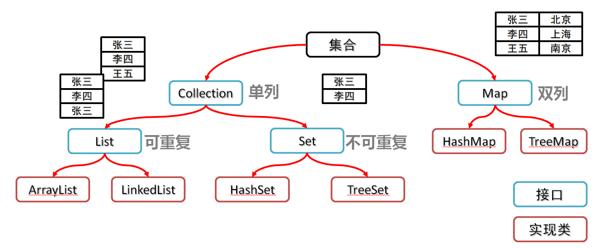
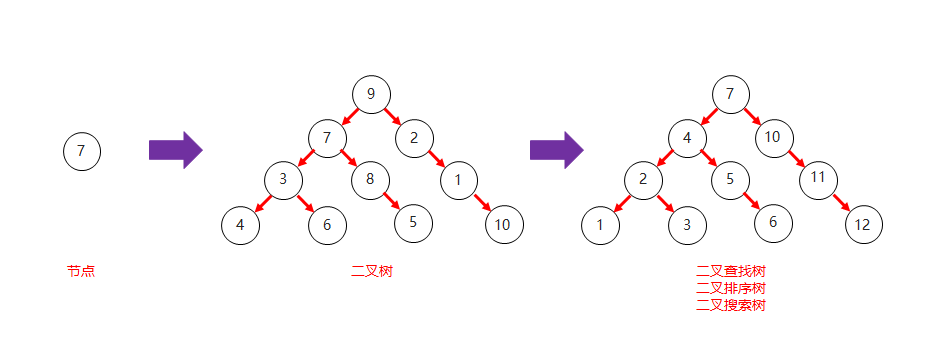
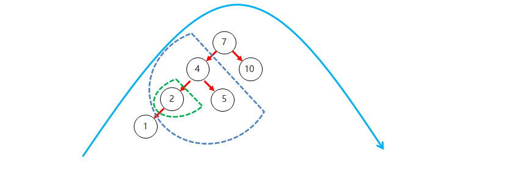
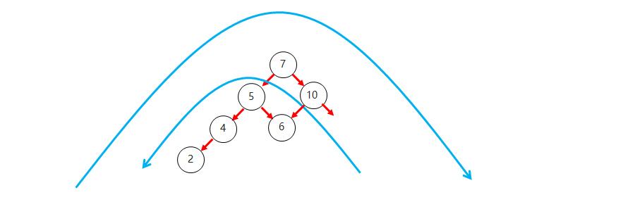
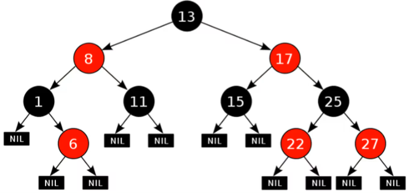
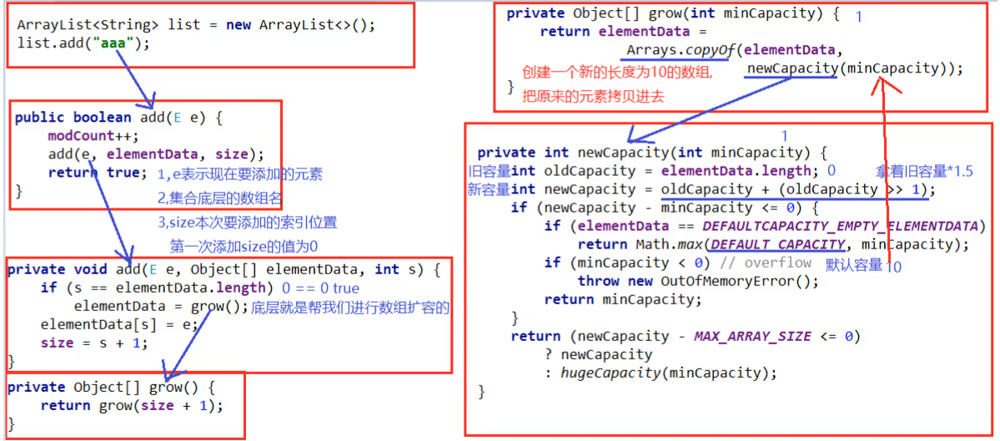

## 1. 集合概述

### 1.1 集合与数组的对比

```java
问题：
        1.如果创建的集合长度为3，在装第4个数据的时候会怎样？
        2.解决集合不能存储基本数据类型的方案是什么？
```

+ 相同点
  + 都是容器，可以存储多个数据
+ 不同点

  + 数组的长度是不可变的,集合的长度是可变的
  + 数组可以存基本数据类型和引用数据类型
  + 集合只能存引用数据类型，如果要存基本数据类型，需要存对应的包装类

### 1.2 集合体系结构

```java
问题：
        1.集合体系主要分为几个部分，分别是什么？
        2.List集合和Set集合中数据的特点分别是什么？
        3.Map集合主要分为几个体系？
```



## 2. Collection集合

### 2.1 常见成员方法

```java
问题：
        1.创建Collection对象需要注意什么？
        2.使用集合的remove方法删除元素，如果集合中没有该元素会怎样？
        3.Collection根据条件删除的方法中，应该传入什么内容？
```

+ Collection集合概述

  + 是单例集合的顶层接口，它表示一组对象，这些对象也称为Collection的元素
  + JDK 不提供此接口的任何直接实现。它提供更具体的子接口（如Set和List）实现

+ 创建Collection集合的对象

  + 多态的方式
  + 具体的实现类ArrayList

+ Collection常见成员方法

  | 方法名                        | 说明                |
                  | :------------------------- | :---------------- |
  | boolean add(E e)           | 添加元素              |
  | boolean remove(Object o)   | 从集合中移除指定的元素       |
  | boolean removeIf(Object o) | 根据条件进行移除          |
  | void   clear()             | 清空集合中的元素          |
  | boolean contains(Object o) | 判断集合中是否存在指定的元素    |
  | boolean isEmpty()          | 判断集合是否为空          |
  | int   size()               | 集合的长度，也就是集合中元素的个数 |

```java
//练习：创建一个集合容器，往容器中添加一些数据，分别使用以上成员方法看看效果
//1.验证的是Collection集合的方法
//多态的写法，父类引用指向子类对象，所以list调用的方法都是父类存在的
Collection<String> list=new ArrayList<>();
//2.使用add方法往集合中添加数据
        list.add("王宝强");
        list.add("贾乃亮");
        list.add("文章");
        System.out.println(list);
//3.这个集合中混入了一个内奸，把文章删掉
/*boolean result = list.remove("文章");
  System.out.println(result);
  System.out.println(list);*/

//4.根据条件删除，使用removeif方法
/*list.removeIf(new Predicate<String>() {
  //4.1 removeIf方法底层会帮我们遍历集合数据，一个个拿出来
  //4.2 传入test方法，所以这个String s就是便利出来的集合元素
  //4.3 如果方法返回值为true，代表可以删除，否则不删除
            @Override
            public boolean test(String s) {
                return s.length()==2;
            }
        });*/
        list.removeIf((s)->{
        return s.length()==2;
        });
        System.out.println(list);
```

### 2.2 迭代器基本使用

```java
问题：
        1.迭代器对象创建好之后，默认指向的元素是哪一个？
        2.迭代器调用next方法，做了几件事情？
        3.如果已经遍历完集合，还要调用迭代器的next方法，会出现什么结果？
```

+ 迭代器介绍

  + 迭代器，集合的专用遍历方式
  + Iterator<E> iterator()：返回此集合中元素的迭代器，通过集合对象的iterator()方法得到，默认指向当前集合的0索引

+ Iterator中的常用方法

  ​ boolean hasNext()：判断当前位置是否有元素可以被取出 ​ E next()：获取当前位置的元素，将迭代器对象移向下一个索引位置

+ Collection集合的遍历

  ```java
  Collection<String> saozi = new ArrayList<>();
  saozi.add("李小璐");
  saozi.add("马蓉");
  saozi.add("董洁");
  saozi.add("孙一宁");
  //遍历集合，打印嫂子
  //1.获取迭代器对象，根据集合对象去获取，不是new
  Iterator<String> iterator = saozi.iterator();
  //为什么要根据集合对象获取迭代器对象呢？
  //因为这样的话，集合中的数据就直接交给了这个迭代器
  //如果是直接new的话，它和集合的数据有半毛钱关系？
  
  //2.开始遍历集合，如果集合中已经没有数据了，迭代器获取数据会报错
  //不知道遍历几次，所以使用while循环，循环的条件就是集合中要有数据
  while (iterator.hasNext()) {
      //3.集合中有数据，开始使用迭代器获取
      String str = iterator.next();
      System.out.println(str);
  }
  //这种使用hasNext和next结合获取数据的语法习惯，不仅仅是迭代器独有的
  //这种语法应用也会在以后学习的数据库中jdbc的内容出现
  //根据这种语法习惯，到时候可以直接推理出jdbc方式获取数据的相关api
  ```

### 2.3 迭代器原理分析

- 遍历的时候通过hasNext方法判断是否还有数据，防止没有数据取数据报错
- 通过next方法，在有数据的前提下返回数据，并且再指向下一个索引位置


- 一旦通过hasNext方法发现没有数据了，就会返回false，遍历结束了


### 2.4 迭代器删除方法

```java
问题：
        1.如果通过普通for循环删除集合元素，需要注意什么？
        2.使用迭代器对象遍历集合删除元素，需要注意什么？
```

- 练习：创建一个集合，有元素a b b c d
  - 思路：使用循环遍历这个集合，判断当前获取到的元素是否为b，如果是就删除
  - 核心方法：void remove()：删除迭代器对象当前持有的元素
  - 注意事项：一旦将集合交给迭代器处理，就不要再使用集合对象去操作数据，否则就会报==ConcurrentModificationException==并发修改异常。

```java
ArrayList<String> list=new ArrayList<>();
        list.add("abc");
        list.add("b");
        list.add("b");
        list.add("df");
        list.add("abc");
//1.因为现在要用迭代器遍历，通过集合对象获取迭代器对象
        Iterator<String> iterator=list.iterator();

//2.有了迭代器对象，可以开始遍历，因为如果没有元素，获取就会报错，遍历前先判断
        while(iterator.hasNext()){
        //还没有调用next方法，就开始删除，程序会报错，因为迭代器此时没有持有数据
        //iterator.remove();
        //本身集合的操作已经给了迭代器，现在集合对象自己又来插一脚，会引发：并发修改异常
        //list.add("a");
        //3.就可以通过迭代器拿出数据
        String s=iterator.next();
        //3.1 next方法调用之后，第一件事获取当前数据，交给迭代器持有
        //3.2 第二件事，指向的位置到了下一个。
        //3.3 只有迭代器持有了数据，才能进行删除
        //4.判断如果拿出的字符串是b，就删除
        if("b".equals(s)){
        //5.使用迭代器的删除方法
        iterator.remove();
        }
        }
//6.打印集合
        System.out.println(list);
```

### 2.5 增强for：基本格式

```java
问题：
        1.增强for的底层是利用什么实现的？
        2.是不是所有的集合都可以使用迭代器和增强for进行遍历呢？
        3.使用格式的时候需要注意哪些问题？
```

+ 介绍

  + 它是JDK5之后出现的,其内部原理是一个Iterator迭代器
  + 实现Iterable接口的类才可以使用迭代器和增强for
  + 简化数组和Collection集合的遍历

+ 格式

  ​ for(集合/数组中元素的数据类型 变量名 :  集合/数组名) {

  ​ // 已经将当前遍历到的元素封装到变量中了,直接使用变量即可

  ​ }

+ 代码

  ```java
  public class MyCollectonDemo1 {
      public static void main(String[] args) {
          ArrayList<String> list =  new ArrayList<>();
          list.add("a");
          list.add("b");
          list.add("c");
          list.add("d");
          list.add("e");
          list.add("f");
  
          //1,数据类型一定是集合或者数组中元素的类型
          //2,str仅仅是一个变量名而已,在循环的过程中,依次表示集合或者数组中的每一个元素
          //3,list就是要遍历的集合或者数组
          for(String str : list){
              //优势就是，当你需要遍历集合的时候，你就不用在考虑范围的事情，也不用考虑条件的事情
              System.out.println(str);
          }
      }
  }
  ```

### 2.6 增强for：注意点

```java
问题：
        1.使用增强for遍历出来的元素变量，修改它的值是否会对集合产生影响？
        2.什么时候选择用增强for，什么时候选择用迭代器呢？
```

- 如果需要操作索引，使用普通for循环
- 如果在遍历的过程中需要删除元素，请使用迭代器
- 如果仅仅想遍历，那么使用增强for

### 2.7 练习

案例：Collection集合存储学生对象并遍历

需求：创建一个Collection集合存储学生对象的集合，存储3个学生对象，使用程序实现在控制台遍历该集合

思路：

1. 定义学生类
2. 创建Collection集合对象
3. 创建学生对象
4. 把学生添加到集合
5. 遍历集合（迭代器方式）

**代码实现：**

```java
ArrayList<Student> students=new ArrayList<>();
        students.add(new Student("张三",23));
        students.add(new Student("李四",16));
        students.add(new Student("王五",28));
        students.add(new Student("赵六",18));
//普通for遍历
        for(int i=0;i<students.size();i++){
        System.out.println(students.get(i));
        }
        System.out.println("===================");
//迭代器
        Iterator<Student> it=students.iterator();
        while(it.hasNext()){
        System.out.println(it.next());
        }

        System.out.println("===================");
//超级for
        for(Student stu:students){
        System.out.println(stu);
        }
```

## 3. 数据结构

### 3.1 栈和队列

```java
问题：
        1.我们学习数据结构的原因是什么？
        2.有哪几种数据结构是比较常见的？
        3.栈结构中元素进出内存的顺序是怎样的？
        4.队列结构中元素进出内存的顺序是怎样的？
```

- 栈结构
  - 先进后出


- 队列结构
  - 先进先出


### 3.2 数组和链表

```java
问题：
        1.数组结构操作数据的特点是什么？
        2.链表中的节点由哪些部分组成？
        3.链表当中第一个被创建出来的节点称之为什么？
        4.链表结构操作数据的特点是什么？
        5.双向链表结构查询数据的特点是什么？
```

- 数组结构
  - 数组是一种==查询快、增删慢==的模型
  - 查询数据通过地址值和索引定位，查询任意数据耗时相同，==查询速度快==
  - 删除数据时，要将原始数据删除，同时后面每个数据前移，==删除效率低==
  - 添加数据时，添加位置后的每个数据后移，再添加元素，==添加效率极低==
- 链表结构
  - 链表是一种==查询慢、增删快==的模型（对比数组）
    - 链表中的每一个元素，我们称之为==节点==，每一个节点都有自己独立的地址值。
    - 链表中第一个被创建出来的节点称之为==头节点==
  - 链表：从头到尾，每个数据按照一个方向指向下一个数据的地址
    - 增删数据时，让新节点指向下一个节点的地址值，让上一个节点指向的地址值改为新节点地址即可
    - 查询数据时：
      - 单向链表：必须从头节点开始查询
      - 双向链表：先判断数据离头近还是离尾近，如果离头近，就从头节点往后找。如果是离尾近，就从后往前找


### 3.3 二叉树

```java
问题：
        1.TreeSet底层是哪一种树结构？
        2.树结构中，每一个节点由几个部分组成？
        3.树结构中，最上层父节点中的父节点地址是什么值？
        4.在树结构中，每一个节点的子节点数量称作什么？
        5.二叉树结构中，任意一个节点的度有什么要求？ 
```

+ 二叉树的特点

  + 二叉树中,任意一个节点的度要小于等于2
    + 节点: 在树结构中,每一个元素称之为节点
    + 度: 每一个节点的子节点数量称之为度

+ 二叉树结构图

  

### 3.4 二叉查找树

```java
问题：
        1.二叉查找树还可以叫做什么？
        2.二叉查找树在结构上有哪些特点？
```

+ 二叉查找树的特点

  + 二叉查找树，又称二叉排序树或者二叉搜索树
  + 每一个节点上最多有两个子节点
  + 左子树上所有节点的值都小于根节点的值
  + 右子树上所有节点的值都大于根节点的值

+ 二叉查找树结构图

  

+ 二叉查找树和二叉树对比结构图

  

### 3.5 二叉查找树添加节点

**二叉查找树添加节点规则:**

- 小的存左边
- 大的存右边
- 一样的不存


### 3.6 平衡二叉树

+ 平衡二叉树的特点

  + 二叉树左右两个子树的高度差不超过1
  + 任意节点的左右两个子树都是一颗平衡二叉树

- 举例：


### 3.7 左旋

```java
问题：
        1.二叉查找树相对于普通二叉树有什么好处？
        2.为了进一步提升二叉查找树的效率，要遵循哪些机制可以保证二叉树的平衡？
        3.旋转机制的触发时机是什么？
        4.对于复杂一点的树结构，左旋机制是如何处理节点的？
```

**平衡二叉树旋转：**

​    **旋转触发时机：**当添加一个节点之后,该树不再是一颗平衡二叉树

**左旋：**

+ 就是将根节点的右侧往左拉,原先的右子节点变成新的父节点,并把多余的左子节点出让,给已经降级的根节点当右子节点
+ 练习：画图，给出4，7，9，10，11，12
  + 画出二叉查找树结构，要求7是根节点，9是10的左子节点
  + 根据左旋原理，将上面的二叉查找树改成平衡二叉树


### 3.8 右旋

+ 就是将根节点的左侧往右拉,左子节点变成了新的父节点,并把多余的右子节点出让,给已经降级根节点当左子节点

  

  

### 3.9 小结

```java
问题：
        1.在往平衡二叉树中添加节点的时候，需要做哪些事情？
```

+ 平衡二叉树和二叉查找树对比结构图

  

### 3.10 平衡二叉树旋转的四种情况

#### 3.10.1 左左和左右

- 左左：

  - 左左: 当根节点左子树的左子树有节点插入，导致二叉树不平衡

  - 如何旋转：直接对整体进行右旋即可

  


- 左右

  - 左右：当根节点左子树的右子树有节点插入,导致二叉树不平衡

  - 如何旋转：先在左子树对应的节点位置进行左旋,在对整体进行右旋

  

#### 3.10.2 右右和右左

+ 右右

  + 右右: 当根节点右子树的右子树有节点插入,导致二叉树不平衡

  + 如何旋转: 直接对整体进行左旋即可

    

+ 右左

  + 右左:当根节点右子树的左子树有节点插入,导致二叉树不平衡

  + 如何旋转: 先在右子树对应的节点位置进行右旋,在对整体进行左旋

    

### 4. 红黑树

#### 4.1 概述

```java
问题：
        1.红黑树是不是一种高度平衡的二叉树？
        2.红黑树和平衡二叉树的区别是什么？
```

- 红黑树的特点

  - 也可以叫平衡二叉B树
  - 每一个节点可以是红或者黑
  - 红黑树不是高度平衡的，它的平衡是通过"自己的红黑规则"进行实现的



#### 4.2 红黑规则

```java
问题：
        1.红黑树的根节点是否可以是红色节点？
        2.红黑树中是否存在连续两个节点都是红色的情况？
        3.红黑树结构中的每个节点由哪几个部分组成？
        4.是否存在根节点的任意两条路径上各有3个和2个黑色节点？
```

- 红黑树的红黑规则有哪些

  1. 每一个节点或是红色的，或者是黑色的

  2. ==根节点必须是黑色==

  3. 如果一个节点没有子节点或者父节点，则该节点相应的指针属性值为==Nil==，这些Nil视为叶节点，每个叶节点(Nil)是黑色的

  4. 如果某一个节点是红色，那么它的子节点必须是黑色(==不能出现两个红色节点相连==的情况)

  5. 对每一个节点，从该节点到其所有后代叶节点的==简单路径==上，均包含相同数目的黑色节点

     

#### 4.3 添加节点的默认颜色

```java
问题：
        1.默认添加元素是黑色时，添加三个元素需要调整几次？
        2.默认添加元素是红色时，添加三个元素需要调整几次？
```

- 添加节点的颜色，可以是红色，也可以是黑色的

  默认添加的节点是黑色时：


​ 添加时8和23都从黑色变为红色，调整了两次


​ 默认添加的节点是红色时：


​ 添加时，根节点20从红色变为黑色，其余不用改变，只调整了1次


- 结论：添加节点时，默认为红色时，效率高

#### 4.4 添加节点后如何保持红黑规则

```java
问题：
        1.当添加的过程中，出现连续两个节点是红色的时候，该如何处理？
        2.当连续两个节点是红色，并且没有叔叔节点时，该如何处理？
```

1. 原始数据：


- 根节点20由红色变为黑色
- 添加过程中，出现两个红色节点连续的情况，需要进行调整


​    **调整规则：**

- 如果父节点和叔叔节点都是红色，需要将父节点和叔节点都设为黑色

- 将祖父节点设为红色，如果祖父节点是根节点，则将祖父节点再变回黑色

  - 调整后：

    

  - 最终效果：


2. 往上面的红黑结构中添加两个红色节点：


- 当出现连续两个节点是红色，并且没有叔叔节点时


​ 解决方案：

​ 将父节点设为黑色，将祖父节点设为红色

​ 以祖父节点为支点进行旋转：


​ 调整后：


**小结：**红黑树在添加节点的时候，添加的节点默认是红色的


## 4. List集合

### 4.1 概述和基本使用

```java
问题：
        1.List集合是有序集合，这个有序指的是什么？
        2.List集合有哪些基本特点？
```

+ List集合的概述
  + 有序集合,这里的有序指的是存取顺序
  + 用户可以精确控制列表中每个元素的插入位置,用户可以通过整数索引访问元素,并搜索列表中的元素
  + 与Set集合不同,列表通常允许重复的元素
+ List集合的特点
  + 存取有序
  + 可以重复
  + 有索引

### 4.2 特有方法

```java
问题：
        1.我们使用的List集合，应该选择哪个包底下的？
        2.List集合使用set方法修改元素成功后，修改前的元素是否还存在？
```

+ 方法介绍

  | 方法名                          | 描述                                   |
                  | ------------------------------- | -------------------------------------- |
  | void add(int index,E   element) | 在此集合中的指定位置插入指定的元素     |
  | E remove(int   index)           | 删除指定索引处的元素，返回被删除的元素 |
  | E set(int index,E   element)    | 修改指定索引处的元素，返回被修改的元素 |
  | E get(int   index)              | 返回指定索引处的元素                   |

+ 示例代码

```java
//目标：掌握List集合的特有功能
public class Test {
  public static void main(String[] args) {
    //1.准备素材
    List<String> list = new ArrayList<>();
    list.add("a");
    list.add("b");
    list.add("c");
    list.add("d");
    //2.验证它的特有方法，先验证add(添加的位置，添加的元素)
    list.add(0, "老姜真帅");
    System.out.println(list);
    //3.remove
    list.remove(1);
    System.out.println(list);
    //4.add方法没有改变其他元素，但是set方法会改变对应索引的元素，将其覆盖
    list.set(2, "老姜真特么帅");
    System.out.println(list);
  }
}
```

```java
/**
 * 课后练习：
 * 1.创建一个List集合，存储10个1~100之间的不重复的随机数，打印集合在控制台
 * 2.删除集合中元素为奇数的数字，然后再打印集合到控制台中
 * 3.将删除操作后的集合进行处理，将集合中第一个元素和最后一个元素调换
 * 4.将集合中中间索引(如果没有中间索引，就增加一个元素)的数据修改为集合中元素的平均值
 */
//1.创建一个List集合，存储10个1~100之间的不重复的随机数，打印集合在控制台
//1.1 创建一个List集合
List<Integer> list=new ArrayList<>();
//1.2 存储10个1~100的随机数，需要Random对象
        Random r=new Random();
//1.3 要创建的是10个不重复的随机数，不知道第几次创建的随机数就是第10个
//不知道获取随机数的次数，所以使用while循环
        while(true){
        //1.4 获取1~100的随机数
        int num=r.nextInt(100)+1;
        //1.5 将随机数添加到集合之前，要判断集合中是否已经存在这个数
        if(!list.contains(num)){
        //如果集合中不包含这个随机数，说明不重复，可以添加
        list.add(num);
        }
        //1.6 如果添加完数据，集合的长度已经是10，就可以结束循环
        if(list.size()==10){
        break;
        }
        }
//1.7 循环结束，打印集合
        System.out.println(list);

//2.删除集合中元素为奇数的数字，然后再打印集合到控制台中
//这是一个删除元素的操作，推荐使用迭代器
        Iterator<Integer> it=list.iterator();
//2.1 遍历集合
        while(it.hasNext()){
        //2.2 将集合中元素遍历出来，判断这个数字是否是奇数
        Integer num=it.next();
        if(num%2!=0){
        //2.3 如果是奇数，就删除
        it.remove();
        }
        }
//2.4 遍历结束，奇数都删除了，打印集合
        System.out.println(list);

//3.将删除操作后的集合进行处理，将集合中第一个元素和最后一个元素调换
//注意：调换元素，设计索引操作，有可能删除完奇数后，集合空了
        if(list.size()==0){
        return;
        }
//3.1 将集合第一个元素和最后一个替换
        int temp=list.get(0);
//将集合中最后一个元素取出，设置给第一个
        list.set(0,list.get(list.size()-1));
        list.set(list.size()-1,temp);

//4.将集合中中间索引的数据修改为集合中元素的平均值

//4.1 获取删除后集合的平均值，没有操作索引，没有删除，使用超级for
        int sum=0;
        for(Integer num:list){
        sum+=num;
        }
//4.2 求平均值
        int avg=sum/list.size();

//4.3 集合先在长度可能是偶数，也可能是奇数
//求中间索引
        int mid=list.size()/2;
        if(list.size()%2==0){
        //如果集合长度是偶数，那就要在中间位置添加一个元素
        list.add(mid,avg);
        }else{
        //如果集合长度是奇数，就在中间位置设置值，替换以前的值
        list.set(mid,avg);
        }
//4.4 打印集合
        System.out.println(list);
```

## 5. List集合的实现类

### 5.1 ArrayList：源码解析

```java
问题：
        1.使用空参构造创建ArrayList集合，它的长度是多少？
        2.ArrayList集合操作数据的特点是什么？
```

- ArrayList：底层数据结构是数组，查询快，增删慢
- 使用空参构造创建的集合，没有添加数据之前，集合和内部数组的长度都是0；
- 添加了一个数据之后，集合的长度是1，但是内部数组的长度是10。



```java
//源码中，这里初始化了一个空的数组，数组长度是0
List<String> list=new ArrayList<>();
/**
 * public boolean add(String e) {
 *         modCount++;
 *         //调用这个三个参数的add方法添加数据
 *         //e是要添加的数据，elementData是初始化的数组，size的值是0
 *         add(e, elementData, size);
 *         return true;
 * }
 *
 *     private void add(E e, Object[] elementData, int s) {
 *     //第一次添加数据，数组长度是0，s是0
 *     //所以调用了grow()。
 *         if (s == elementData.length)
 *         //把返回的新数组，替换了原来的旧数组
 *             elementData = grow();
 *             //再去给这个替换后的数组赋值，s索引赋值
 *         elementData[s] = e;
 *         //size还得加1，因为多了一个数据
 *         size = s + 1;
 *     }
 *
 *
 *     private Object[] grow() {
 *     //size+1=1
 *         return grow(size + 1);
 *     }
 *
 *
 *     private Object[] grow(int minCapacity) {
 *     //Arrays.copyOf()这个方法是创建一个新的数组，把老数组的数据复制到新数组中
 *     //关键就是新数组的长度是多少，新数组就是后面一个参数
 *     //newCapacity(1)
 *         return elementData = Arrays.copyOf(elementData,
 *                                            newCapacity(minCapacity));
 *     }
 *
 *
 *     private int newCapacity(int minCapacity) {
 *          //minCapacity=1
 *          //elementData.length是0。所以oldCapacity也是0，代表旧数组容量
 *         int oldCapacity = elementData.length;
 *         //oldCapacity + (oldCapacity >> 1);这句是自己的容量加上自己一半的容量，扩容1.5倍
 *         //扩容后的容量给了新容量newCapacity
 *         int newCapacity = oldCapacity + (oldCapacity >> 1);
 *         //第一次的时候就容量是0，所以扩容后还是0，这里继续判断
 *         if (newCapacity - minCapacity <= 0) {
 *     //第一次添加数据的时候，满足这个判断的条件，能够进来
 *     //elementData现在是空数组
 *     //DEFAULTCAPACITY_EMPTY_ELEMENTDATA这个也是个空数组，就是一开始给elementData赋值的那个数组
 *     //肯定相等
 *             if (elementData == DEFAULTCAPACITY_EMPTY_ELEMENTDATA)
 *             //就能执行这一句，获取两个参数的其中最大的那个值
 *             //minCapacity是1，DEFAULT_CAPACITY是10，得到的结果是10
 *                 return Math.max(DEFAULT_CAPACITY, minCapacity);
 *                 //相当于return 10
 *             if (minCapacity < 0) // overflow
 *                 throw new OutOfMemoryError();
 *             return minCapacity;
 *         }
 *         return (newCapacity - MAX_ARRAY_SIZE <= 0)
 *             ? newCapacity
 *             : hugeCapacity(minCapacity);
 *     }
 */
        list.add("a");
```

### 5.2 LinkedList：基本运用

```java
问题：
        1.LinkedList操作数据的特点是什么？
```

- LinkedList：底层是链表结构实现，查询慢、增删快
- 练习：使用LinkedList完成存储字符串并遍历

```java
LinkedList<String> ll=new LinkedList<>();
        ll.add("李小璐");
        ll.add("马蓉");
        ll.add("董洁");
        ll.add("潘金莲");
//遍历集合：普通for
        for(int i=0;i<ll.size();i++){
        System.out.println(ll.get(i));
        }
        System.out.println("====================");
//迭代器
        Iterator<String> it=ll.iterator();
        while(it.hasNext()){
        System.out.println(it.next());
        }

        System.out.println("====================");
        for(String s:ll){
        System.out.println(s);
        }
```

### 5.3 LinkedList：特有功能

- 特有方法

  | 方法名                       | 说明               |
                  | ------------------------- | ---------------- |
  | public void addFirst(E e) | 在该列表开头插入指定的元素    |
  | public void addLast(E e)  | 将指定的元素追加到此列表的末尾  |
  | public E getFirst()       | 返回此列表中的第一个元素     |
  | public   E getLast()      | 返回此列表中的最后一个元素    |
  | public E removeFirst()    | 从此列表中删除并返回第一个元素  |
  | public   E removeLast()   | 从此列表中删除并返回最后一个元素 |

- 示例代码

  ```java
  public class MyLinkedListDemo4 {
      public static void main(String[] args) {
          LinkedList<String> list = new LinkedList<>();
          list.add("aaa");
          list.add("bbb");
          list.add("ccc");
          // public void addFirst(E e)：在该列表开头插入指定的元素
  
	        // public void addLast(E e)：将指定的元素追加到此列表的末尾
  
          // public E getFirst()：返回此列表中的第一个元素
  
          // public E getLast()：返回此列表中的最后一个元素
  
          // public E removeFirst()：从此列表中删除并返回第一个元素
  
          // public E removeLast()：从此列表中删除并返回最后一个元素
  		
      }
  }
  ```

### 5.4 LinkedList：源码解析

```java
问题：
        1.在链表结构中的节点，底层源码中是用哪个类去描述的？
        2.查看LinkedList源码，应该关注哪几个方法？
        3.LinkedList底层是单向列表还是双向列表？
```


## 6. 泛型

### 6.1 概述

```java
问题：
        1.如果在创建集合的时候不写泛型，会遇到什么问题？
        2.泛型的出现具有哪些好处？
```

- 泛型的介绍
  - 泛型是JDK5中引入的特性，它提供了编译时类型安全检测机制
- 泛型的好处
  - 把运行时期的问题提前到了编译期间
  - 避免了强制类型转换

### 6.2 泛型类的使用

```java
问题：
        1.泛型可以使用在哪些地方？
        2.在设计ArrayList的时候，为什么会把它设计为泛型类？
        3.<E>中的E代表的是什么意思？
        4.泛型类对象，比如ArrayList，是什么时候可以确定容器中存储的数据类型？
```

- 泛型可以使用的地方：
  - 类后面：==泛型类==
  - 方法声明上：==泛型方法==
  - 接口后面：==泛型接口==
- 如果一个类的后面有`<E>`，表示这个类是一个泛型类。E就代表一个不确定的数据类型
- 创建泛型类的对象时，必须要给这个泛型类确定具体的数据类型

### 6.3 自定义泛型类

```java
问题：
        1.泛型除了能指定一种数据类型，是否还能指定多种数据类型？
        2.常见的有哪些字母的参数代表泛型中的类型呢？
```

泛型的定义格式

- <类型>：指定一种类型的格式

  - 尖括号里面可以任意书写，一般只写一个字母。例如: `<E>`，` <T>`，`<Q>`，`<M>`

- <类型1,类型2…>：指定多种类型的格式，多种类型之间用逗号隔开。例如：`<E,T>`，` <K,V>`

- 定义格式

  ```java
  修饰符 class 类名<类型> {  }
  ```

- 泛型类

  ```java
  //此处T可以随便写为任意标识，常见的如T、E、K、V等形式的参数，常用于表示泛型
  
  public class Generic<T> {
      private T t;
  
      public T getT() {
          return t;
      }
  
      public void setT(T t) {
          this.t = t;
      }
  }
  ```

- 测试类

  ```java
  public class GenericDemo1 {
      public static void main(String[] args) {
          Generic<String> g1 = new Generic<String>();
          g1.setT("杨幂");
          System.out.println(g1.getT());
  
          Generic<Integer> g2 = new Generic<Integer>();
          g2.setT(30);
          System.out.println(g2.getT());
  
          Generic<Boolean> g3 = new Generic<Boolean>();
          g3.setT(true);
          System.out.println(g33.getT());
      }
  }
  ```

```java
public class Test {
  public static void main(String[] args) {
    //3.使用自定义的泛型类，在创建对象的时候确定类型
    MyGenericityClass<String> m1 = new MyGenericityClass<>();
    m1.setE("我现在是字符串，我是创建对象的时候确定的这个类型");
    String s = m1.getE();
    System.out.println(s);

    //4.再创建一个对象，指定Integer类型
    MyGenericityClass<Integer> m2 = new MyGenericityClass<>();
    m2.setE(520);
    Integer num = m2.getE();
    System.out.println(num);

    //5.体验到的好处是什么？提高了一个类的扩展性，设计的时候，不需要再定义那么多不同类型的方法
  }
}

//目标：掌握自定义泛型类的格式书写和应用
class MyGenericityClass<E> {
  //1.定义属性，以前我们需要确定这个属性的类型，现在就可以直接使用E
  E e;

  //2.自动生成set和get方法，两个方法会自动应用泛型
  public E getE() {
    return e;
  }

  public void setE(E e) {
    this.e = e;
  }
}
```

### 6.4 泛型方法的使用

```java
问题：
        1.如果调用ArrayList集合的toArray()空参方法返回一个数组，会有什么问题？
        2.如果需要将ArrayList集合转换成特定类型的数组，可以使用哪个方法？
```

**ArrayList：**

| 返回值     | 方法             | 介绍                                                         |
| ---------- | ---------------- | ------------------------------------------------------------ |
| `Object[]` | `toArray()`      | 以正确的顺序（从第一个到最后一个元素）返回一个包含此列表中所有元素的数组 |
| `<T> T[]`  | `toArray(T[] a)` | 以正确的顺序返回一个包含此集合中所有元素的数组（从第一个到最后一个元素）； |

```java
//练习：将一个存放String类型数据ArrayList集合转换成String数组
ArrayList<String> list=new ArrayList<>();
        list.add("良好的心态");
        list.add("高效的方法");
        list.add("持之以恒的努力");
//1.将集合对象转换成数组对象
        Object[]os=list.toArray();
//使用带参的toArray方法，可以传入一个字符串数组
        String[]sts=list.toArray(new String[0]);
        System.out.println(Arrays.toString(sts));
//2.要将集合转换成特定数据类型，需要用到有参的方法
//list.toArray(new Integer[3]);//可以接收不同数据类型的数组，确定返回的数组类型
//3.体验到：通过泛型方法的使用，可以让一个方法接收很多数据类型的参数，提高方法的扩展性
```

### 6.5 自定义泛型方法

- 定义格式

  ```java
  修饰符 <类型> 返回值类型 方法名(类型 变量名) {  }
  ```

- 示例代码

  - 带有泛型方法的类

    ```java
    public class Generic {
        public <T> void show(T t) {
            System.out.println(t);
        }
    }
    ```

  - 测试类

    ```java
    public class GenericDemo2 {
        public static void main(String[] args) {
            Generic g = new Generic();
            g.show("柳岩");
            g.show(30);
            g.show(true);
            g.show(12.34);
        }
    }
    ```

```java
//需求：自定义一个泛型方法，可以接收不同数据类型的参数，返回不同类型的ArrayList集合
public class Test {
  public static void main(String[] args) {
    //2.使用泛型方法
    MyGenericity m = new MyGenericity();
    ArrayList<String> list = m.add(new ArrayList<String>(), "李小璐", "马蓉", "董洁", "孙一宁");
    ArrayList<Integer> list1 = m.add(new ArrayList<Integer>(), 1, 2, 3, 4);
    System.out.println(list);
    System.out.println(list1);
    //3.体验：通过泛型方法的使用，提高了方法的扩展性
  }
}

class MyGenericity {
  //1.定义泛型方法
  //这个方法就可以接收不同类型的参数，并且返回不同类型的集合
  public <T> ArrayList<T> add(ArrayList<T> list, T... t) {
    //T...t，代表一个可变参数，这个t最后就是T类型的数组，存放了传过来的各种T类型的数据
    //遍历t数组，将数据存入list集合
    for (T t1 : t) {
      list.add(t1);
    }
    return list;
  }
}
```

**扩展练习：自定义ArrayList集合（根据自己喜好，选择是否练习）**：

- 步骤分析：
  - 创建一个泛型类：MyArrayList<E>
  - 增加一个Object数组类型的属性，初始长度是0，作为数据容器
  - 增加一个int类型的属性size，用来记录集合内数据的个数
  - 定义add方法，方法形式参数为泛型类指定的泛型==E==类型，方法返回值类型为布尔类型
  - 定义get方法，方法形式参数为int类型，方法返回值类型为泛型类指定的泛型==E==类型
  - 在实现add方法的过程中，完成扩容方法grow()的定义
  - 定义size()方法，用于返回集合内数据的个数
- 代码实现：

```java
//1.自定义一个泛型类，代表自己制作的集合
public class MyArrayList<E> {
  //2.有一个数组容器，数组类型是Object类型
  private Object[] array = {};
  //3.定义一个属性，代表集合内数据的个数
  private int size;
  //4.这里省略构造方法，默认提供一个空参构造，而且因为属性值是制定好的
  //所以创建对象的时候，就会自动初始化为一个长度为0的数组
  //5.集合应该具备添加和获取的方法，以及获取集合内数据个数的方法

  /**
   * 添加功能
   *
   * @param element 被添加的元素
   * @return 是否添加成功的结果，true代表成功，false代表失败
   */
  public boolean add(E element) {
    //6.判断集合内数组容器是否需要扩容
    if (size == array.length) {
      //7.如果集合内元素个数size和集合内数组容器长度相同
      //代表数组已经存满了，需要扩容
      //8.定义一个给数组扩容的方法，实现扩容功能
      grow();
    }
    //9.不管有没有扩容，能执行到这一步，说明数组容器的长度已经足够，可以开始赋值
    //10.给数组容器赋值，值是传过来的element
    //赋值到哪个索引？假设集合内元素个数现在是3，要赋值的元素是第4个
    //那就应该往数组索引为3的位置上赋值，索引值刚好就是size的值
    array[size] = element;
    //11.赋值成功，集合内元素个数多了一个，size要加1
    size++;
    return true;
  }

  /**
   * 给集合内数组容器扩容
   * 由于是只给内部使用的方法，不允许外人随意调用，所以使用private修饰
   */
  private void grow() {
    //12.开始给数组容器扩容
    //13.先获取没有扩容前，数组的长度
    int length = array.length;
    //14.有两种情况，一种长度是0，一种长度是某个整数
    if (length == 0) {
      //15.如果数组长度是0，就扩容为10
      length = 10;
    } else {
      //16.如果数组长度不是0，只是不够了，就扩容为原来的1.5倍
      length = length + length >> 1;
    }
    //17.此时数组长度length的值已经是10，或者为原来的1.5倍了
    //18.新数组的长度有了，可以创建一个新数组，长度为length
    Object[] newArr = new Object[length];
    //19.将旧数组array的值，按顺序复制到新数组中
    for (int i = 0; i < array.length; i++) {
      newArr[i] = array[i];
    }
    //20.现在新数组中有了旧数组的所有值，并且还有很多空着的位置
    //就可以将新数组的地址值替换掉旧数组array的地址值
    array = newArr;
    //因为旧数组是座位集合的属性存在的，所以新数组必须把他当地址值给array替换掉
    //21.到此，就完成了数组容器array的扩容
  }

  /**
   * 根据索引获取元素
   *
   * @param index 集合中元素所在的索引
   * @return 被返回的元素
   */
  public E get(int index) {
    //22.添加方法处理完之后，就可以开始实现获取方法
    //23.根据索引获取集合中的数据
    //24.首先要判断传过来的索引是否合法
    if (index < 0 || index >= size) {
      //如果传过来的索引小于0，或者超过了集合内数据的个数，就没有这个数
      //提示用户，并且返回一个null值
      System.out.println("索引越界");
      return null;
    }
    //25.获取数组内对应索引的值，是一个Object类型，需要强制数据类型转换
    //转换到什么数据类型？只能转换到泛型指定的类型，这里用E替代
    E o = (E) array[index];
    return o;
  }

  /**
   * 返回集合内数据的个数，也就是集合的长度。注意和内部数组的长度是两码事
   *
   * @return 集合内数据的个数
   */
  public int size() {
    return size;
  }
}

public class Test {
  public static void main(String[] args) {
    MyArrayList<String> list = new MyArrayList<>();
    list.add("a");
    list.add("b");
    list.add("c");
    for (int i = 0; i < list.size(); i++) {
      String s = list.get(i);
      System.out.println(s);
    }
  }
}
```

### 6.6 泛型接口

```java
问题：
        1.泛型接口有几种使用方式？
        2.如果接口的实现类确定了具体的数据类型，还是泛型类吗？
```

- 定义格式

  ```java
  修饰符 interface 接口名<类型> { }
  ```

- 示例代码

  - 泛型接口

    ```java
    public interface Generic<T> {
        void show(T t);
    }
    ```

  - 泛型接口实现类1

    ​ 定义实现类时,定义和接口相同泛型,创建实现类对象时明确泛型的具体类型

    ```java
    public class GenericImpl1<T> implements Generic<T> {
        @Override
        public void show(T t) {
            System.out.println(t);
        }
    }
    ```

  - 泛型接口实现类2

    ​ 定义实现类时,直接明确泛型的具体类型

    ```java
    public class GenericImpl2 implements Generic<Integer>{
         @Override
         public void show(Integer t) {
              System.out.println(t);
         }
    }
    ```

  - 测试类

    ```java
    public class GenericDemo3 {
        public static void main(String[] args) {
            GenericImpl1<String> g1 = new GenericImpl<String>();
            g1.show("林青霞");
            GenericImpl1<Integer> g2 = new GenericImpl<Integer>();
            g2.show(30);
          
            GenericImpl2 g3 = new GenericImpl2();
              g3.show(10);
        }
    }
    ```

```java
//目标：掌握泛型接口的定义和使用
public class Test {
  public static void main(String[] args) {
    MyGeneiricity1<String> m1 = new MyGeneiricity1<>();
    m1.method("我们班全部月薪过万");
    MyGeneiricity2 m2 = new MyGeneiricity2();
    m2.method(1314);
    //3.体验：提高了代码的扩展性
  }
}

//1.定义泛型接口。就是在接口名后面加<E>
interface MyGenericityInter<E> {
  void method(E e);
}

//2.使用泛型接口，定义一个类去实现，有两种方式
//2.1 不指定类型，在创建实现类对象的时候才指定
class MyGeneiricity1<E> implements MyGenericityInter<E> {

  @Override
  public void method(E e) {
    System.out.println(e);
  }
}

//2.2 指定类型，这个实现类就不是泛型类
class MyGeneiricity2 implements MyGenericityInter<Integer> {

  @Override
  public void method(Integer e) {
    System.out.println(e);
  }
}
```

### 6.7 通配符

```java
问题：
        1.如果ArrayList后面的尖括号中用了通配符？,那有什么作用？
        2.通配符最为强大的功能是什么？
        3.<?extends Number> 代表什么意思？
        4.<? super Number>代表什么意思？
```

- 类型通配符: <?>

  - ArrayList<?>: 表示元素类型未知的ArrayList,它的元素可以匹配任何的类型
  - 但是并不能把元素添加到ArrayList中了,获取出来的也是父类类型

- 类型通配符上限: <? extends 类型>

  - ArrayListList <? extends Number>: 它表示的类型是Number或者其子类型

- 类型通配符下限: <? super 类型>

  - ArrayListList <? super Number>: 它表示的类型是Number或者其父类型


- 泛型通配符的使用

  ```java
  public class GenericDemo4 {
      public static void main(String[] args) {
          ArrayList<Integer> list1 = new ArrayList<>();
          ArrayList<String> list2 = new ArrayList<>();
          ArrayList<Number> list3 = new ArrayList<>();
          ArrayList<Object> list4 = new ArrayList<>();
  
          method(list1);
          method(list2);
          method(list3);
          method(list4);
  
          getElement1(list1);
          getElement1(list2);//报错
          getElement1(list3);
          getElement1(list4);//报错
  
          getElement2(list1);//报错
          getElement2(list2);//报错
          getElement2(list3);
          getElement2(list4);
      }
    
      // 泛型通配符: 此时的泛型?,可以是任意类型
      public static void method(ArrayList<?> list){}
      // 泛型的上限: 此时的泛型?,必须是Number类型或者Number类型的子类
      public static void getElement1(ArrayList<? extends Number> list){}
      // 泛型的下限: 此时的泛型?,必须是Number类型或者Number类型的父类
      public static void getElement2(ArrayList<? super Number> list){}
  }
  ```

