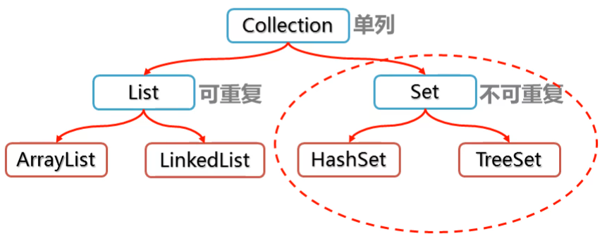
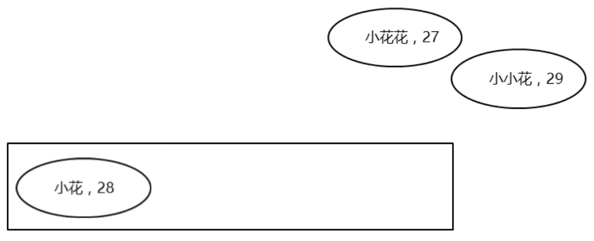
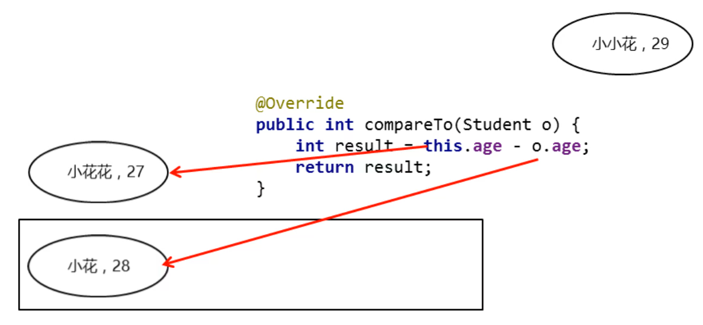
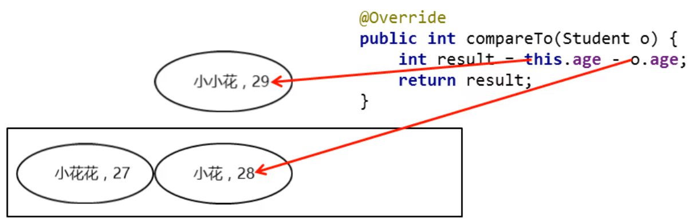
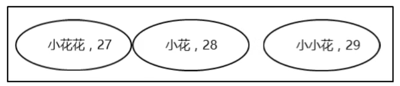
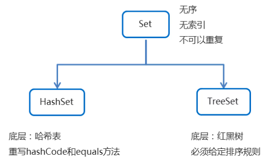

## Set集合

### 1. 概述

```java
问题：
        1.set集合有几个主要学习的实现类？
        2.set集合最为主要的特点是什么？
```



### 2. 基本使用

```java
问题：
        1.set集合有哪些特点？
        2.能不能使用普通for循环遍历Set集合？
```

- 可以去除重复
- 存取顺序不一致
- 没有带索引的方法，所以不能使用普通for循环遍历，也不能通过索引来获取、删除Set集合中的元素

存储字符串并遍历

```java
public class MySet1 {
  public static void main(String[] args) {
    //创建集合对象
    Set<String> set = new TreeSet<>();
    //添加元素
    set.add("ccc");
    set.add("aaa");
    set.add("aaa");
    set.add("bbb");

//      for (int i = 0; i < set.size(); i++) {
//          //Set集合是没有索引的，所以不能使用通过索引获取元素的方法
//      }

    //遍历集合
    Iterator<String> it = set.iterator();
    while (it.hasNext()) {
      String s = it.next();
      System.out.println(s);
    }
    System.out.println("-----------------------------------");
    for (String s : set) {
      System.out.println(s);
    }
  }
}
```

## TreeSet集合

### 1. 基本使用

```java
问题：
        1.TreeSet集合具有哪些特点？
        2.TreeSet集合对象直接打印的话，能不能显示存储的数据值？
        3.TreeSet集合如果存储引用数据类型对象，会出现什么问题？
        4.如果需要使用TreeSet集合，必须要注意什么？
```

**TreeSet集合概述和特点：**

+ 不可以存储重复元素
+ 没有索引
+ 可以将元素按照规则进行排序
  + TreeSet()：根据其元素的自然排序进行排序
  + TreeSet(Comparator comparator) ：根据指定的比较器进行排序

**案例：存储Integer类型的整数并遍历：**

```java
public class TreeSetDemo01 {
  public static void main(String[] args) {
    //创建集合对象
    TreeSet<Integer> ts = new TreeSet<Integer>();

    //添加元素
    ts.add(10);
    ts.add(40);
    ts.add(30);
    ts.add(50);
    ts.add(20);

    ts.add(30);

    //遍历集合
    for (Integer i : ts) {
      System.out.println(i);
    }
  }
}
```

### 2. 自然排序

```java
问题：
        1.给TreeSet集合指定排序规则有几种方式？
        2.指定自然排序规则的步骤有哪些？
        3.如果compareTo方法返回值是负数，代表什么？
```

**Comparable的使用：**

- 案例需求

  - 存储学生对象并遍历，创建TreeSet集合使用无参构造方法
  - 要求：按照年龄从小到大排序，年龄相同时，按照姓名的字母顺序排序

- 实现步骤

  1. 使用空参构造创建TreeSet集合
    + 用TreeSet集合存储自定义对象，无参构造方法使用的是自然排序对元素进行排序的
  2. 自定义的Student类实现Comparable接口
    + 自然排序，就是让元素所属的类实现Comparable接口，重写compareTo(T o)方法
  3. 重写接口中的compareTo方法
    + 重写方法时，一定要注意排序规则必须按照要求的主要条件和次要条件来写

**自然排序简单原理图：**

- 如果返回值为负数，表示当前存入的元素是较小值，存左边
- 如果返回值为0，表示当前存入的元素跟集合中元素重复了，不存
- 如果返回值为正数，表示当前存入的元素是较大值，存右边









**代码实现：**

学生类

```java
public class Student implements Comparable<Student> {
  private String name;
  private int age;

  public Student() {
  }

  public Student(String name, int age) {
    this.name = name;
    this.age = age;
  }

  public String getName() {
    return name;
  }

  public void setName(String name) {
    this.name = name;
  }

  public int getAge() {
    return age;
  }

  public void setAge(int age) {
    this.age = age;
  }

  @Override
  public String toString() {
    return "Student{" +
            "name='" + name + '\'' +
            ", age=" + age +
            '}';
  }

  @Override
  public int compareTo(Student o) {
    //按照对象的年龄进行排序
    //主要判断条件: 按照年龄从小到大排序
    return this.age - o.age;
  }
}
```

测试类：

```java
public class MyTreeSet2 {
  public static void main(String[] args) {
    //创建集合对象
    TreeSet<Student> ts = new TreeSet<>();
    //创建学生对象
    Student s1 = new Student("zhangsan", 28);
    Student s2 = new Student("lisi", 27);
    Student s3 = new Student("wangwu", 29);
    Student s4 = new Student("zhaoliu", 28);
    Student s5 = new Student("qianqi", 30);
    //把学生添加到集合
    ts.add(s1);
    ts.add(s2);
    ts.add(s3);
    ts.add(s4);
    ts.add(s5);
    //遍历集合
    for (Student student : ts) {
      System.out.println(student);
    }
  }
}
```

### 3. 自然排序练习

**需求：**改写刚刚的学生案例

**要求：**

1. 按照年龄从小到大排，如果年龄一样，则按照姓名首字母排序
2. 如果姓名和年龄一样，才认为是同一个学生对象，不存入

**代码实现：**

```java
public class Student implements Comparable<Student> {
  private String name;
  private int age;

  public Student() {
  }

  public Student(String name, int age) {
    this.name = name;
    this.age = age;
  }

  public String getName() {
    return name;
  }

  public void setName(String name) {
    this.name = name;
  }

  public int getAge() {
    return age;
  }

  public void setAge(int age) {
    this.age = age;
  }

  @Override
  public String toString() {
    return "Student{" +
            "name='" + name + '\'' +
            ", age=" + age +
            '}';
  }

  @Override
  public int compareTo(Student o) {
    //按照对象的年龄进行排序
    //主要判断条件: 按照年龄从小到大排序
    int result = this.age - o.age;
    //次要判断条件: 年龄相同时，按照姓名的字母顺序排序
    result = result == 0 ? this.name.compareTo(o.getName()) : result;
    return result;
  }
}
```

### 4. 比较器排序

```java
问题：
        1.如果要使用TreeSet集合的比较器排序，创建集合对象能否用空参构造？
        2.集合的构造方法要接收什么类型的对象，重写什么方法？
        3.在重写方法时应该注意哪些问题？
```

如果同时实现了比较器排序和自然排序，优先使用比较器排序

**Comparator的使用：**

- 案例需求

  - 存储老师对象并遍历，创建TreeSet集合使用带参构造方法
  - 要求：按照年龄从小到大排序，年龄相同时，按照姓名的字母顺序排序

- 实现步骤

  - 用TreeSet集合存储自定义对象，带参构造方法使用的是比较器排序对元素进行排序的
  - 比较器排序，就是让集合构造方法接收Comparator的实现类对象，重写compare(T o1,T o2)方法
  - 重写方法时，一定要注意排序规则必须按照要求的主要条件和次要条件来写

- 代码实现

  老师类

  ```java
  public class Teacher {
      private String name;
      private int age;
  
      public Teacher() {
      }
  
      public Teacher(String name, int age) {
          this.name = name;
          this.age = age;
      }
  
      public String getName() {
          return name;
      }
  
      public void setName(String name) {
          this.name = name;
      }
  
      public int getAge() {
          return age;
      }
  
      public void setAge(int age) {
          this.age = age;
      }
  
      @Override
      public String toString() {
          return "Teacher{" +
                  "name='" + name + '\'' +
                  ", age=" + age +
                  '}';
      }
  }
  ```

  测试类

  ```java
  public class Test {
      public static void main(String[] args) {
          //1.创建集合对象，如果想要使用比较器排序，就不能使用空参创建对象
          //得使用有参构造，传入一个Comparetor接口的实现类对象，这里可以用匿名内部类
          TreeSet<Teacher> ts = new TreeSet<>(new Comparator<Teacher>() {
              @Override
              public int compare(Teacher o1, Teacher o2) {
                  //2.重写的compare方法有两个参数，第一个代表当前正在添加的数据
                  //第二个就是集合中已经添加的数据
                  //那比较规则和自然排序用过的规则一样
                  int result = o1.getAge() - o2.getAge();
                  //结果有可能是0，所以得再根据姓名判断，而姓名是字符串类型，所以直接调用字符串的comapareTo
                  return result == 0 ? o1.getName().compareTo(o2.getName()) : result;
              }
          });
          //3.创建了集合对象，排序规则也有了，可以开始添加数据
          ts.add(new Teacher(20, "zs"));
          ts.add(new Teacher(19, "ls"));
          ts.add(new Teacher(22, "ww"));
          ts.add(new Teacher(20, "zl"));
  
          //4.打印集合对象，看看数据是否添加成功
          System.out.println(ts);
      }
  }
  ```

### 5. 两种比较方式的对比

```java
问题：
        1.两种比较方式，我们如何做选择？
```

+ 两种比较方式小结
  + 自然排序: 自定义类实现Comparable接口,重写compareTo方法,根据返回值进行排序
  + 比较器排序: 创建TreeSet对象的时候传递Comparator的实现类对象,重写compare方法,根据返回值进行排序
  + 在使用的时候,默认使用自然排序,当自然排序不满足现在的需求时,必须使用比较器排序
+ 两种方式中关于返回值的规则
  + 如果返回值为负数，表示当前存入的元素是较小值，存左边
  + 如果返回值为0，表示当前存入的元素跟集合中元素重复了，不存
  + 如果返回值为正数，表示当前存入的元素是较大值，存右边

- 需求：请自行选择比较器排序和自然排序两种方式；
  - 存入四个字符串，"c"，"ab"，"df"，"qwer"
  - 按照长度排序，如果一样长则按照首字母排序

- 代码实现：

```java
TreeSet<String> set=new TreeSet<>(new Comparator<String>(){
@Override
public int compare(String o1,String o2){
        //根据字符串长度比较，长的放后边
        int result=o1.length()-o2.length();
        //次要条件，再去根据字符串自己的规则比较
        result=result==0?o1.compareTo(o2):result;
        return result;
        }
        });
        set.add("ad");
        set.add("df");
        set.add("c");
        set.add("qwer");
        System.out.println(set);
```

## HashSet集合

### 1. 基本使用

```java
问题：
        1.HashSet集合的底层结构是什么？
        2.HashSet存取数据的特点是什么？
        3.HashSet集合能否使用普通for循环进行遍历？
```

**HashSet集合特点：**

- 底层数据结构是哈希表
- 不能保证存储和取出的顺序完全一致
- 没有带索引的方法，所以不能使用普通for循环遍历
- 由于是Set集合，所以元素唯一

**HashSet集合练习**

- 存储字符串并遍历

**代码实现：**

```java
//创建集合对象
HashSet<String> set=new HashSet<String>();

//添加元素
        set.add("hello");
        set.add("world");
        set.add("java");
//不包含重复元素的集合
        set.add("world");

//遍历
        for(String s:set){
        System.out.println(s);
        }
```

### 2. 哈希值

```java
问题：
        1.哈希值可以由几种方式得到，分别是什么？
        2.不重写hashCode方法的时候，哈希值有什么特点？
        3.重写hashCode方法后，一般是通过什么计算哈希值，有什么特点？
```

- 哈希值简介
  - 是JDK根据对象的==地址==或者==属性值==，算出来的int类型的==整数==
- 如何获取哈希值
  - Object类中的`public int hashCode()`：返回对象的哈希码值
- 对象的哈希值的特点

  - 如果没有重写hashCode方法，那么是根据对象的地址值计算出的哈希值
  - 同一个对象多次调用hashCode()方法返回的哈希值是相同的
    - 默认情况下，不同对象的哈希值是不同的
  - 如果重写了hashCode方法，一般都是通过对象的属性值计算出哈希值
    - 如果不同的对象属性值是一样的，那么计算出来的哈希值也是一样的

```java
/**
 * 练习：
 * 1.创建一个Student学生类
 * 		属性：姓名、年龄
 * 		构造器
 * 		set\get方法
 * 2.在没有重写hashCode方法的情况下，在测试类中创建三个学生对象
 * 3.三个学生对象，有两个对象的属性值一样，分别调用其hashCode方法，打印哈希值观察效果
 * 4.在Student中重写了hashCode方法后，再观察三个对象的哈希值效果
 */

```

### 3. JDK7底层原理解析

```java
问题：
        1.JDK8以前，哈希表底层采用什么方式实现？
        2.添加元素时，存储的位置是通过什么方式得到的？
        3.如果添加元素时，计算得到的位置上有值，会如何操作？
        4.新添加的元素假设被添加到了链表上，它在链表的什么位置？
        5.在什么情况下，新添加的元素不会存入集合中？
```

哈希表

- JDK8之前，底层采用==数组 + 链表==实现
- JDK8以后，底层采用==数组+链表+红黑树==实现


- 加载因子：例如加载因子为0.75，则底层数组长度为16的时候，存到第16*0.75个元素的时候就开始扩容

### 4. JDK8底层优化

```java
问题：
        1.当集合底层的数组上的链表长度为多少时，会自动转换为红黑树？
        2.改进之后，存储流程有没有发生改变？
```

- JDK1.8以后

  - 节点个数少于等于8个
    - 数组 + 链表
  - 节点个数多于8个
    - 数组 + 红黑树


- 原理修改的原因：提高效率，否则当链表越来越长的时候，比较的过程也是非常耗费效率的

### 5. 练习

- 案例需求

  - 创建一个存储学生对象的集合，存储多个学生对象，使用程序实现在控制台遍历该集合
  - 要求：学生对象的成员变量值相同，我们就认为是同一个对象

- 代码实现

  学生类

  ```java
  public class Student {
      private String name;
      private int age;
  
      public Student() {
      }
  
      public Student(String name, int age) {
          this.name = name;
          this.age = age;
      }
  
      public String getName() {
          return name;
      }
  
      public void setName(String name) {
          this.name = name;
      }
  
      public int getAge() {
          return age;
      }
  
      public void setAge(int age) {
          this.age = age;
      }
  
      @Override
      public boolean equals(Object o) {
          if (this == o) return true;
          if (o == null || getClass() != o.getClass()) return false;
  
          Student student = (Student) o;
  
          if (age != student.age) return false;
          return name != null ? name.equals(student.name) : student.name == null;
      }
  
      @Override
      public int hashCode() {
          int result = name != null ? name.hashCode() : 0;
          result = 31 * result + age;
          return result;
      }
  }
  ```

  测试类

  ```java
  public class HashSetDemo02 {
      public static void main(String[] args) {
          //创建HashSet集合对象
          HashSet<Student> hs = new HashSet<Student>();
  
          //创建学生对象
          Student s1 = new Student("林青霞", 30);
          Student s2 = new Student("张曼玉", 35);
          Student s3 = new Student("王祖贤", 33);
  
          Student s4 = new Student("王祖贤", 33);
  
          //把学生添加到集合
          hs.add(s1);
          hs.add(s2);
          hs.add(s3);
          hs.add(s4);
  
          //遍历集合(增强for)
          for (Student s : hs) {
              System.out.println(s.getName() + "," + s.getAge());
          }
      }
  }
  ```

- 总结

  ​ HashSet集合存储自定义类型元素,要想实现元素的唯一,要求必须重写hashCode方法和equals方法

### 6. 小结



## Map集合

### 1. 基本使用

```java
问题：
        1.双列集合中的键和值分别有什么特点？
        2.

interface Map<K, V>中，哪个是键，哪个是值？
        3.在java中，"键值对对象"也叫什么？
```

**Map集合概述和使用**

- Map集合概述

  ```java
  interface Map<K,V>  K：键的类型；V：值的类型
  ```

- Map集合的特点

  - 双列集合，一个键对应一个值
  - 键不可以重复，值可以重复

- Map集合的基本使用

  ```java
  public class MapDemo01 {
      public static void main(String[] args) {
          //创建集合对象
          Map<String,String> map = new HashMap<String,String>();
        //V put(K key, V value) 将指定的值与该映射中的指定键相关联
          map.put("itheima001","林青霞");
          map.put("itheima002","张曼玉");
          map.put("itheima003","王祖贤");
          map.put("itheima003","柳岩");
          //输出集合对象
        System.out.println(map);
      }
  }
  ```

### 2. Map常用方法

```java
问题：
        1.map集合添加数据时，如果添加的键存在，会发生什么？
        2.如果想要知道map集合中是否存在某个键，使用哪个方法？
        3.map集合的size方法是获取map集合中的键值总数还是键值对个数？
```

- 方法介绍

  | 方法名                              | 说明                                 |
    | ----------------------------------- | ------------------------------------ |
  | V   put(K key,V   value)            | 添加元素                             |
  | V   remove(Object key)              | 根据键删除键值对元素                 |
  | void   clear()                      | 移除所有的键值对元素                 |
  | boolean containsKey(Object key)     | 判断集合是否包含指定的键             |
  | boolean containsValue(Object value) | 判断集合是否包含指定的值             |
  | boolean isEmpty()                   | 判断集合是否为空                     |
  | int size()                          | 集合的长度，也就是集合中键值对的个数 |

- 示例代码

  ```java
  //目标：掌握map集合的一些常用方法的使用
  public class Test {
      public static void main(String[] args) {
          //创建集合对象
          Map<String,String> map = new HashMap<String,String>();
          //V put(K key,V value)：添加元素
          map.put("张无忌","赵敏");
          map.put("郭靖","黄蓉");
          map.put("杨过","小龙女");
          //1.打印集合
          System.out.println(map);
          map.put("杨过", "李莫愁");
          //结论：使用put方法，如果键已存在，就会覆盖原有的值
          System.out.println(map);
          //2.使用remove方法，根据键删除键值对
          map.remove("郭靖");
          System.out.println(map);
          //3.使用clear清空集合
          //map.clear();
          //System.out.println(map);
          boolean result1 = map.containsKey("张无忌");
          boolean result2 = map.containsKey("郭靖");
          System.out.println(result1);
          System.out.println(result2);
          //4.验证是否为空和size方法
          boolean result3 = map.isEmpty();
          System.out.println(result3);
          int size = map.size();
          System.out.println(size);
      }
  }
  ```

### 3. Map集合的遍历（方式1）

```java
1.第一种遍历集合的流程有哪些？
        2.在遍历集合的过程中，有哪些关键的方法？
```

- 方法介绍

  | 方法名              | 说明             |
    | ------------------- | ---------------- |
  | V   get(Object key) | 根据键获取值     |
  | Set<K>   keySet()   | 获取所有键的集合 |


- 遍历思路

  - 我们刚才存储的元素都是成对出现的，所以我们把Map看成是一个夫妻对的集合
    - 把所有的丈夫给集中起来
    - 遍历丈夫的集合，获取到每一个丈夫
    - 根据丈夫去找对应的妻子

- 步骤分析

  - 获取所有键的集合。用keySet()方法实现
  - 遍历键的集合，获取到每一个键。用增强for实现
  - 根据键去找值。用get(Object key)方法实现

- 代码实现

  ```java
  public class MapDemo01 {
      public static void main(String[] args) {
          //创建集合对象
          Map<String, String> map = new HashMap<String, String>();
        //添加元素
          map.put("张无忌", "赵敏");
          map.put("郭靖", "黄蓉");
          map.put("杨过", "小龙女");
  
        //获取所有键的集合。用keySet()方法实现
          Set<String> keySet = map.keySet();
          //遍历键的集合，获取到每一个键。用增强for实现
          for (String key : keySet) {
              //根据键去找值。用get(Object key)方法实现
              String value = map.get(key);
              System.out.println(key + "," + value);
          }
      }
  }
  ```

### 4. Map集合的遍历（方式2）

```java
问题：
        1.第二种遍历map集合的流程有哪些？
        2.在遍历流程中，有哪些关键的方法？
```

- 方法介绍

| 方法名                           | 说明                     |
| -------------------------------- | ------------------------ |
| Set<Map.Entry<K,V>>   entrySet() | 获取所有键值对对象的集合 |
| K getKey()                       | 获得键                   |
| V getValue()                     | 获得值                   |
| Collection<V>   values()         | 获取所有值的集合         |

- 遍历思路

  - 我们刚才存储的元素都是成对出现的，所以我们把Map看成是一个夫妻对的集合
    - 获取所有结婚证的集合
    - 遍历结婚证的集合，得到每一个结婚证
    - 根据结婚证获取丈夫和妻子

- 步骤分析

  - 获取所有键值对对象的集合
    - Set<Map.Entry<K,V>> entrySet()：获取所有键值对对象的集合
  - 遍历键值对对象的集合，得到每一个键值对对象
    - 用增强for实现，得到每一个Map.Entry
  - 根据键值对对象获取键和值
    - 用getKey()得到键
    - 用getValue()得到值

- 代码实现

  ```java
  public class MapDemo02 {
      public static void main(String[] args) {
          //创建集合对象
          Map<String, String> map = new HashMap<String, String>();
        //添加元素
          map.put("张无忌", "赵敏");
          map.put("郭靖", "黄蓉");
          map.put("杨过", "小龙女");
  
        //获取所有键值对对象的集合
          Set<Map.Entry<String, String>> entrySet = map.entrySet();
          //遍历键值对对象的集合，得到每一个键值对对象
          for (Map.Entry<String, String> me : entrySet) {
              //根据键值对对象获取键和值
              String key = me.getKey();
              String value = me.getValue();
              System.out.println(key + "," + value);
          }
      }
  }
  ```

## HashMap集合

### 1. HashMap原理解析

```java
问题：
        1.HashMap在底层的数据规则具体是什么样子的？
        2.HashMap在底层的数组长度是多少，默认加载因子是多少？
        3.如果在添加元素的时候，数组的位置上已经有值，会发生什么？
        4.HashMap在底层是如何保证键的唯一性？
```

- HashMap的特点
  - HashMap是Map里面的一个实现类
  - 没有额外需要学习的方法，直接使用Map里面的方法即可
  - HashMap跟HashSet一样底层是哈希表结构
- HashMap的添加规则
  - 底层是数组+链表形式存在
  - 先根据键和值在内存创建出Entry键值对对象
  - 然后计算出键的哈希值，根据哈希值再计算出在数组中的位置
  - 如果这个位置是null，就直接将键值对对象添加进去
  - 如果不是null，会调用equals方法来比较键的值
  - 如果比较的结果一样，就会覆盖原先的键值对
  - 如果不一样，新的就会添加到数组中，原先的就会挂到下面，形成链表
  - 如果链表的长度大于等于8的时候，会自动转化为红黑树
- HashMap小结
  - HashMap底层是哈希表结构的
  - 依赖hashCode方法和equals方法保证键的唯一
  - 如果键要存储的是自定义对象，需要重写hashCode和equals方法

### 2. HashMap练习

- 案例需求

  - 创建一个HashMap集合，键是学生对象(Student)，值是居住地 (String)。存储多个元素，并遍历。
  - 要求保证键的唯一性：如果学生对象的成员变量值相同，我们就认为是同一个对象

- 代码实现

  学生类

  ```java
  public class Student {
      private String name;
      private int age;
  
      public Student() {
      }
  
      public Student(String name, int age) {
          this.name = name;
          this.age = age;
      }
  
      public String getName() {
          return name;
      }
  
      public void setName(String name) {
          this.name = name;
      }
  
      public int getAge() {
          return age;
      }
  
      public void setAge(int age) {
          this.age = age;
      }
  
      @Override
      public boolean equals(Object o) {
          if (this == o) return true;
          if (o == null || getClass() != o.getClass()) return false;
  
          Student student = (Student) o;
  
          if (age != student.age) return false;
          return name != null ? name.equals(student.name) : student.name == null;
      }
  
      @Override
      public int hashCode() {
          int result = name != null ? name.hashCode() : 0;
          result = 31 * result + age;
          return result;
      }
  }
  ```

  测试类

  ```java
  public class HashMapDemo {
      public static void main(String[] args) {
          //创建HashMap集合对象
          HashMap<Student, String> hm = new HashMap<Student, String>();
  
          //创建学生对象
          Student s1 = new Student("林青霞", 30);
          Student s2 = new Student("张曼玉", 35);
          Student s3 = new Student("王祖贤", 33);
          Student s4 = new Student("王祖贤", 33);
  
          //把学生添加到集合
          hm.put(s1, "西安");
          hm.put(s2, "武汉");
          hm.put(s3, "郑州");
          hm.put(s4, "北京");
  
          //遍历集合
          Set<Student> keySet = hm.keySet();
          for (Student key : keySet) {
              String value = hm.get(key);
              System.out.println(key.getName() + "," + key.getAge() + "," + value);
          }
          System.out.println("===============================");
          
          hm.forEach((Student key, String value) -> {
              //打印数据
              System.out.println(key + "..." + value);
          });
          
      }
  }
  ```

## TreeMap集合

### 1. TreeMap集合概述和特点

```java
问题:
        1.TreeMap在添加元素时，比较的时候关心的是键还是值？
        2.对键进行排序时，依赖哪些规则排序？
```

- TreeMap的特点
  - TreeMap是Map里面的一个实现类
  - 没有额外需要学习的方法，直接使用Map里面的方法即可
  - TreeMap跟你TreeSet一样底层是红黑树结构
- TreeMap底层原理
  - 调用put方法，在底层创建了一个Entry对象
  - 添加到红黑树中，节点颜色默认是红色，第一个元素是根节点，所以颜色改为黑色
  - 后续添加依然是根据红黑树规则，但是在比较的时候只关心键，不关系值
- TreeMap小结
  - TreeMap底层是红黑树结构
  - 依赖自然排序或者比较器排序,对键进行排序
  - 如果键存储的是自定义对象,需要实现Comparable接口或者在创建TreeMap对象时候给出比较器排序规则

### 2. TreeMap练习

+ 案例需求

  + 创建一个TreeMap集合,键是学生对象(Student),值是籍贯(String),学生属性姓名和年龄,按照年龄进行排序并遍历
  + 要求按照学生的年龄进行排序,如果年龄相同则按照姓名进行排序
+ 代码实现

```java
public class Student implements Comparable<Student> {
  private String name;
  private int age;

  public Student(String name, int age) {
    this.name = name;
    this.age = age;
  }

  public String getName() {
    return name;
  }

  public void setName(String name) {
    this.name = name;
  }

  public int getAge() {
    return age;
  }

  public void setAge(int age) {
    this.age = age;
  }

  @Override
  public String toString() {
    return "Student{" +
            "name='" + name + '\'' +
            ", age=" + age +
            '}';
  }

  @Override
  public int compareTo(Student o) {
    //1.给出自然排序的比较规则，这里按从大到小
    int result = o.getAge() - this.getAge();
    //2.给出次要条件
    result = result == 0 ? o.getName().compareTo(this.getName()) : result;
    return result;
  }
}

public class Test {
  public static void main(String[] args) {
    //3.创建HashMap集合对象
    //7.改成比较器排序，增加比较器的规则，这里用从小到大排序
    TreeMap<Student, String> hm = new TreeMap<Student, String>(new Comparator<Student>() {
      @Override
      public int compare(Student o1, Student o2) {
        //指定比较器排序规则。从小往大
        int result = o1.getAge() - o2.getAge();
        result = result == 0 ? o1.getName().compareTo(o2.getName()) : result;
        return result;
      }
    });

    //4.创建学生对象
    Student s1 = new Student("林青霞", 30);
    Student s2 = new Student("张曼玉", 35);
    Student s3 = new Student("王祖贤", 33);
    Student s4 = new Student("王祖贤", 33);
    //5.添加数据到集合
    hm.put(s1, "西安");
    hm.put(s2, "上海");
    hm.put(s3, "北京");
    hm.put(s4, "深圳");
    System.out.println(hm);
    //6.遍历集合
    hm.forEach((Student key, String value) -> {
      System.out.println(key + "..." + value);
    });
  }
}
```

## 可变参数

### 1. 可变参数

```java
问题：
        1.在JDK5之前，要定义一个求n个数的和的方法，是如何操作的？
        2.可变参数在底层其实就是一个什么东西？
        3.一个方法的形式参数里能否写两个可变参数？
```

- 可变参数介绍

  - 可变参数又称参数个数可变，用作方法的形参出现，那么方法参数个数就是可变的了
  - 方法的参数类型已经确定，个数不确定，我们可以使用可变参数

- 可变参数定义格式

  ```java
  修饰符 返回值类型 方法名(数据类型… 变量名) {  }
  ```

- 可变参数的注意事项

  - 这里的变量其实是一个数组
  - 如果一个方法有多个参数，包含可变参数，==可变参数要放在最后==

- 可变参数的基本使用

  ```java
  /**
   * 定义一个方法，可以求任意数量的整数和
   */
  public class Test {
      public static void main(String[] args) {
          //1.jdk5之前完成这个需求，需要在方法的形式参数定义一个数组类型的变量
          //这种方式，会导致在使用的时候必须提供一个数组，还得自己定义。假设我只需要求两三个整数和，这种就很不方便
          System.out.println(getSum(1, 2, 3, 4, 5));
      }
  
      /**
       * 定义一个方法，可以求任意数量的整数和
       * 2.可以使用可变参数去改进
       * 3.可变参数必须放在最后，在实际调用的时候，当识别可变参数时，这个数量其实不确定的
       * 你传入多少个实际参数，就代表这个数组多长，你在可变参数后面再放一个会形成干扰
       */
      public static int getSum(int... arr) {
          int sum = 0;
          for (int i : arr) {
              sum += i;
          }
          return sum;
      }
  }
  ```

### 2. 创建不可变集合

```java
问题：
        1.通过List.of方法创建出来的集合，能否做增、删、改操作？
        2.不可变集合的使用场景是什么，有什么好处？
        3.map.of方法创建不可变集合时，键值对和参数是如何对应的？
        4.map的什么方法比of的可读性更强？
```

- 方法介绍

  - 在List、Set、Map接口中，都存在==of方法==，可以==创建==一个==不可变的集合==
    - 这个集合不能添加，不能删除，不能修改
    - 但是可以结合集合的带参构造，实现集合的批量添加
  - 在Map接口中，还有一个ofEntries方法可以提高代码的阅读性
    - 首先会把键值对封装成一个Entry对象，再把这个Entry对象添加到集合当中
- 示例代码

```java
//目标：掌握不可变集合的创建和使用
public class Test {
  public static void main(String[] args) {
    //1.创建不可变集合，通过of静态方法，可以直接通过接口名调用
    List<String> l1 = List.of("a", "b", "c");
    //这个l1就是一个不可变集合
    //2.验证不可变性
    //l1.add("c");
    //l1.remove("a");
    //l1.set(0, "A");
    //System.out.println(l1);
    //通过结果可知，运行报错，确实是不可变的集合
    //3.使用场景是什么呢？可以对集合进行批量增加数据，不需要多次使用add方法。结合集合的有参构造
    ArrayList<String> l2 = new ArrayList<>(l1);
    System.out.println(l2);
    l2.add("d");
    System.out.println(l2);
    //4.除了list还有set和map
    //Set<String> set = Set.of("a", "b", "c", "a");
    //报错了，说明set集合创建不可变参数时，不允许元素重复
    Set<String> set = Set.of("a", "b", "c", "d");
    System.out.println(set);
    //5.map创建不可变集合
    //键和值是交叉给与的
    Map<String, String> map = Map.of("a", "1", "b", "2");
    System.out.println(map);
    //提高阅读性的方法
    //Map<String, String> map = Map.ofEntries(Map.entry("张无忌", "赵敏"),Map.entry("郭靖", "黄蓉"));
  }
}
```

```java
/**
 * 需求：
 * 1.有一个学生类，有课程属性：private List<String> courses = new ArrayList<>();
 * 1.1 使用构造代码块，为课程属性添加不同的学科
 * 1.2 对外暴露get方法，让外界可以知晓该学生对象所有的学科
 * 2.对外没有暴露set方法，学生的课程属性是否可以更改？
 * 3.如果可以更改，该怎么解决这个问题？
 */

public class Test {
  public static void main(String[] args) {
    //1.创建学生对象
    Student stu = new Student();
    List<String> courses = stu.getCourses();
    System.out.println(courses);
    try {
      //给集合添加学科
      courses.add("政治");
      //2.再次利用学生对象获取学科信息
      System.out.println(stu.getCourses());
    } catch (Exception e) {
      System.out.println("正在做非法修改");
    }
  }
}

class Student {
  private List<String> courses = new ArrayList<>();

  {
    courses.add("语文");
    courses.add("数学");
    courses.add("英语");
  }

  public List<String> getCourses() {
    //对于封装来说，如果属性是一个引用数据类型，封装性就很难保证，特别是集合
    //哪怕没有提供set方法，外界也可以修改数据
    //这里就可以使用不可变集合。可以使用list的copyOf方法将普通集合转换成不可变集合
    return List.copyOf(courses);
  }
}
```

