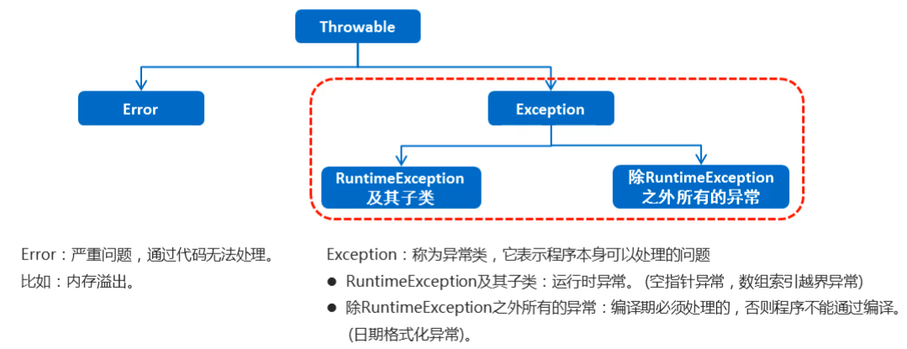
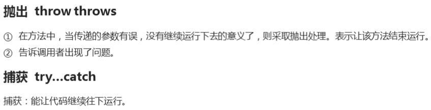

## Stream流

### 1. Stream流初体验

```java
问题：
        1.使用Stream流编程，有什么好处？
        2.Stream流过滤一些条件，使用的是什么方法？
```

- 案例需求：按照下面的要求完成集合的创建和遍历

    - 创建一个集合，存储多个字符串元素
    - 把集合中所有以"张"开头的元素存储到一个新的集合
    - 把"张"开头的集合中的长度为3的元素存储到一个新的集合
    - 遍历上一步得到的集合

- 原始方式示例代码

```java
public class MyStream1 {
    public static void main(String[] args) {
        //集合的批量添加
        ArrayList<String> list1 =
                new ArrayList<>(List.of("张三丰", "张无忌", "张翠山", "王二麻子", "张良", "谢广坤"));
        //遍历list1把以张开头的元素添加到list2中。
        ArrayList<String> list2 = new ArrayList<>();
        for (String s : list1) {
            if (s.startsWith("张")) {
                list2.add(s);
            }
        }
        //遍历list2集合，把其中长度为3的元素，再添加到list3中。
        ArrayList<String> list3 = new ArrayList<>();
        for (String s : list2) {
            if (s.length() == 3) {
                list3.add(s);
            }
        }
        for (String s : list3) {
            System.out.println(s);
        }
    }
}
```

- 使用Stream流示例代码

```java
public class StreamDemo {
    public static void main(String[] args) {
        //集合的批量添加
        ArrayList<String> list1 =
                new ArrayList<>(List.of("张三丰", "张无忌", "张翠山", "王二麻子", "张良", "谢广坤"));

        //Stream流
        list1.stream().filter(s -> s.startsWith("张"))
                .filter(s -> s.length() == 3)
                .forEach(s -> System.out.println(s));
    }
}
```

- Stream流的好处

    - 直接阅读代码的字面意思即可完美展示无关逻辑方式的语义：
        - 获取流、过滤姓张、过滤长度为3、逐一打印
    - Stream流把真正的函数式编程风格引入到Java中
    - 代码简洁

### 2. Stream流思想特点

```java
问题：
        1.Stream流的思想特点和工厂中的什么很相似？
        2.学习Stream流操作数据，流程中包含哪些方法？
```

- Stream流的思想

  

- 主要学习的三类方法：获取方法、中间方法、终结方法

### 3. Stream流获取方法

```java
问题：
        1.在哪些情况下就可以使用Steam流？
        2.双列集合是怎样获取到一个Stream流的？
        3.数组是如何获取Stream流的？
```

- Stream流的三类方法

    - 获取Stream流
        - 创建一条流水线，并把数据放到流水线上准备进行操作
    - 中间方法
        - 流水线上的操作
        - 一次操作完毕之后，还可以继续进行其他操作
    - 终结方法
        - 一个Stream流只能有一个终结方法
        - 是流水线上的最后一个操作
- 生成Stream流的方式

    - Collection体系集合：
        - 使用默认方法stream()生成流， default Stream<E> stream()
    - Map体系集合：
        - 把Map转成Set集合，==间接==的生成流
    - 数组：
        - 通过Arrays中的==静态方法stream()==生成流
    - 同种数据类型的多个数据：
        - 通过Stream接口的==静态方法of(T... values)==生成流
- 代码演示

```java
//1.可以获取单列结合的Stream流
//1.1 创建一个单列集合
ArrayList<String> l1=new ArrayList<>(List.of("a","b","c"));
//1.2 通过stream()方法可以获取流
        Stream<String> stream=l1.stream();
        stream.forEach(System.out::println);
        System.out.println("======================");
//2.可以获取双列结合的Stream流
//2.1 创建一个双列结合
        HashMap<String, String> map=new HashMap<>();
        map.put("张无忌","赵敏");
        map.put("郭靖","黄蓉");
        map.put("杨过","李莫愁");
//2.2 双列集合，可以简洁获取：获取键的流、值的流、键值对的流
//获取键的流
        map.keySet().stream().forEach(s->System.out.println(s));
//获取值的流
        map.values().stream().forEach(s->System.out.println(s));
//获取键值对对象的流。
//entry->System.out.println(entry)可以使用对象方法引用优化成：System.out::println
        map.entrySet().stream().forEach(System.out::println);
        System.out.println("======================");
//3.可以获取数组的流
        int[]arr={1,2,3,4,5};
//通过Arrays的stream方法
        Arrays.stream(arr).forEach(System.out::println);
        System.out.println("======================");
//4.获取同种数据类型的多个数据的Stream流
        Stream.of("a","b","c").forEach(System.out::println);
        System.out.println("======================");
//5.通过建造者模式获取Stream流
        Stream.Builder<Object> builder=Stream.builder();
//这是一个可以用来创建Stream流对象的工具
//可以使用这个工具往流中添加数据
        builder.add("a").add("b").add("c").add("d").build().forEach(System.out::println);
```

### 4. Stream流中间操作方法-filter

```java
问题：
        1.Predicate的test方法主要是做什么的？
        2.Predicate的test方法中的形式参数代表什么？
        3.Stream流的forEach方法有什么作用？
```

- 概念
    - 中间操作的意思是，执行完此方法之后，Stream流依然可以继续执行其他操作
- 常见方法

| 方法名                                | 说明                     |
| ------------------------------------- | ------------------------ |
| Stream<T> filter(Predicate predicate) | 用于对流中的数据进行过滤 |

- Predicate接口中的方法：boolean test(T s)
    - 对给定的参数进行判断，返回一个布尔值
    - s依次表示流中的每一个数据
    - Predicate接口中只有一个抽象方法test，可以使用lambda表达式简化
    - test方法返回为true的时候，保留这个遍历出来的数据
    - 如果返回为false的时候，去掉这个数据
- filter代码演示

```java
//目标：掌握Stream流中间过滤方法的使用
public class Test {
    public static void main(String[] args) {
        ArrayList<String> list = new ArrayList<>();
        list.add("张三丰");
        list.add("张无忌");
        list.add("张翠山");
        list.add("王二麻子");
        list.add("张良");
        list.add("谢广坤");
        //1.将集合转换成Stream流。stream（）
        Stream<String> stream = list.stream();
        //2.有了流，就可以开始进行中间过滤方法，filter方法
        /*
        stream.filter(new Predicate<String>() {
            @Override
            public boolean test(String s) {
                //3.这里就可以给出过滤判断
                //当遍历出来的数据以张开头，返回true
                //返回true，流就会保留这个数据
                //如果是false，就会去掉
                return s.startsWith("张");
            }

        });
        //这种写法，但是阅读性很差，需要使用Lambda进行优化
        */
        //stream.filter((String s)->{return s.startsWith("张");});
        //Lambda表达式也可以继续简化
        stream.filter(s -> s.startsWith("张")).forEach(System.out::println);
    }
}
```

### 5. 其他常用中间方法

```java
问题：
        1.中间方法中的distinct方法是依赖什么进行去重的？
        2.limit截取方法，是截取前面的还是后面的？
```

| 方法名                                          | 说明                                                       |
| ----------------------------------------------- | ---------------------------------------------------------- |
| Stream<T> limit(long maxSize)                   | 返回此流中的元素组成的流，截取前指定参数个数的数据         |
| Stream<T> skip(long n)                          | 跳过指定参数个数的数据，返回由该流的剩余元素组成的流       |
| static <T> Stream<T> concat(Stream a, Stream b) | 合并a和b两个流为一个流                                     |
| Stream<T> distinct()                            | 返回由该流的不同元素（根据Object.equals(Object) ）组成的流 |

- limit&skip代码演示

  ```java
  public class StreamDemo02 {
      public static void main(String[] args) {
          //创建一个集合，存储多个字符串元素
          ArrayList<String> list = new ArrayList<String>();
          list.add("林青霞");
          list.add("张曼玉");
          list.add("王祖贤");
          list.add("柳岩");
          list.add("张敏");
          list.add("张无忌");
  
          //需求1：取前3个数据在控制台输出
  
          System.out.println("--------");
  
          //需求2：跳过3个元素，把剩下的元素在控制台输出
  
          System.out.println("--------");
  
          //需求3：跳过2个元素，把剩下的元素中前2个在控制台输出
  
      }
  }
  ```

- concat&distinct代码演示

  ```java
  public class StreamDemo03 {
      public static void main(String[] args) {
          //创建一个集合，存储多个字符串元素
          ArrayList<String> list = new ArrayList<String>();
          list.add("林青霞");
          list.add("张曼玉");
          list.add("王祖贤");
          list.add("柳岩");
          list.add("张敏");
          list.add("张无忌");
  
          //需求1：取前4个数据组成一个流
  
          //需求2：跳过2个数据组成一个流
  
          //需求3：合并需求1和需求2得到的流，并把结果在控制台输出
  
          //需求4：合并需求1和需求2得到的流，并把结果在控制台输出，要求字符串元素不能重复
  
      }
  }
  ```

```java
//需求：获取5个不同的随机数
public class Test {
    public static void main(String[] args) {
        //1.创建Random对象
        //2.循环获取随机数
        //3.因为可能会出现重复，所以还要去除重复
        //如果使用Stream流的方式实现，就会变得很简单
        //1.创建一个Random对象
        Random r = new Random();
        //2.Random对象有一个方法，可以获取随机数的流
        IntStream intStream = r.ints(1, 11);
        //这个流是一个无限的随机数，可以通过limit方法截取你要的随机数个数
        //再通过distinct方法去除重复
        intStream.distinct().limit(5).forEach(System.out::println);
    }
}
```

### 6. Stream流终结操作方法

```java
问题：
        1.Stream流常见的终结方法有哪些，分别有什么作用？
        2.forEach方法执行，它的底层做了哪些事情？
```

- 概念

    - 终结操作的意思是，执行完此方法之后，Stream流将不能再执行其他操作

- 常见方法

  | 方法名                           | 说明           |
    | ----------------------------- | ------------ |
  | void forEach(Consumer action) | 对此流的每个元素执行操作 |
  | long count()                  | 返回此流中的元素数    |

- 代码演示

  ```java
  public class MyStream5 {
      public static void main(String[] args) {
          ArrayList<String> list = new ArrayList<>();
          list.add("张三丰");
          list.add("张无忌");
          list.add("张翠山");
          list.add("王二麻子");
          list.add("张良");
          list.add("谢广坤");
  
          //method1(list);
  
          //long count()：返回此流中的元素数
          long count = list.stream().count();
          System.out.println(count);
      }
  
      private static void method1(ArrayList<String> list) {
          //void forEach(Consumer action)：对此流的每个元素执行操作
          //Consumer接口中的方法void accept(T t)：对给定的参数执行此操作
          //在forEach方法的底层,会循环获取到流中的每一个数据.
          //并循环调用accept方法,并把每一个数据传递给accept方法
          //s就依次表示了流中的每一个数据.
          //所以，我们只要在accept方法中，写上处理的业务逻辑就可以了.
          list.stream().forEach(
              new Consumer<String>() {
                  @Override
                  public void accept(String s) {
                      System.out.println(s);
                  }
              }
          );
  
          System.out.println("====================");
          //lambda表达式的简化格式
          //是因为Consumer接口中,只有一个accept方法
          list.stream().forEach(
              (String s)->{
                  System.out.println(s);
              }
          );
          System.out.println("====================");
          //lambda表达式还是可以进一步简化的.
          list.stream().forEach(s->System.out.println(s));
      }
  }
  ```

### 7. Stream流不能直接修改数据源中的数据

- 需求：在集合中添加1~10的10个数字，然后去掉里面的奇数，保留偶数。

```java
public class Test {
    public static void main(String[] args) {
        //1.创建集合，添加数据
        ArrayList<Integer> list = new ArrayList<>();
        for (int i = 1; i <= 10; i++) {
            list.add(i);
        }
        //2.开始操作集合，使用Stream流的方式操作，更加简单
        //保留某某，删除某某，这是一种过滤操作，使用filter
        list.stream().filter(number -> number % 2 == 0).forEach(System.out::println);
        //3.打印原本的集合，数据没有变化。结论：Stream流的操作没有影响原本集合（数据源）的数据
        System.out.println(list);
    }
}
```

### 8. Stream流的收集操作

- 概念

    - 对数据使用Stream流的方式操作完毕后，可以把流中的数据收集到集合中

- 常用方法

  | 方法名                            | 说明        |
    | ------------------------------ | --------- |
  | R collect(Collector collector) | 把结果收集到集合中 |

- 工具类Collectors提供了具体的收集方式

  | 方法名                                      | 说明            |
    | ---------------------------------------- | ------------- |
  | public static <T> Collector toList()     | 把元素收集到List集合中 |
  | public static <T> Collector toSet()      | 把元素收集到Set集合中  |
  | public static  Collector toMap(Function keyMapper,Function valueMapper) | 把元素收集到Map集合中  |

- 代码演示

```java
public class Test {
    public static void main(String[] args) {
        //1.创建集合，添加数据
        ArrayList<Integer> list = new ArrayList<>();
        for (int i = 1; i <= 10; i++) {
            list.add(i);
        }
        list.add(10);
        list.add(6);
        //2.开始操作集合，使用Stream流的方式操作，更加简单
        //保留某某，删除某某，这是一种过滤操作，使用filter
        list.stream().filter(number -> number % 2 == 0).forEach(System.out::println);
        //3.要把数据收集起来，使用collect方法，但这个方法只负责收集数据
        //如果要创建容器，把收集的数据放到容器中，还需要一个工具类Collectors
        //toList可以转换成List集合
        List<Integer> list1 = list.stream().filter(number -> number % 2 == 0).collect(Collectors.toList());
        System.out.println(list1);
        //toSet转换成Set集合，可以去除重复
        Set<Integer> set = list.stream().filter(number -> number % 2 == 0).collect(Collectors.toSet());
        System.out.println(set);
    }
}
```

```java
/**
 * 目标：掌握Stream流的收集方法：toMap方l法
 * 1.创建一个ArrayList集合，并添加以下字符串。字符串中前面是姓名，后面是年龄
 * 		"zhangsan,23"
 * 		"lisi,24"
 * 		"wangwu,25"
 * 2.保留年龄大于等于24岁的人，并将结果收集到Map集合中，姓名为键，年龄为值
 */
public class Test {
    public static void main(String[] args) {
        //1.创建结合，准备数据
        ArrayList<String> list = new ArrayList<>();
        list.add("zhangsan,23");
        list.add("lisi,24");
        list.add("wangwu,25");
        //2.准备开始操作数据
        //2.1 转换成Stream流
        Map<String, String> map = list.stream()
                //2.2 过滤条件
                /**
                 *  //Lambda中代码块，未简写
                 *   String[] strs = s.split(",");
                 *   int age=Integer.valueOf(strs[1]);
                 *   return age >= 24;
                 *
                 */
                .filter(s -> Integer.valueOf(s.split(",")[1]) >= 24)
                //2.2 先收集数据，再转成map。使用collect方法和Collectors
                /**
                 * toMap中有两个Lambda表达式
                 * 第一个Lambda表达式，有一个形式参数，代表流中的每一个遍历出来的数据
                 *  在代码块中，可以针对这个数据进行操作，返回一个数据值，会把这个数据值作为
                 *  map的键
                 *
                 *  第二个Lambda表达式，也是一样，只是返回的值会作为map集合的值
                 */
                .collect(Collectors.toMap(
                        s -> s.split(",")[0],
                        s -> s.split(",")[1]
                ));
        System.out.println(map);
    }
}
```

### 9. Stream流综合练习

- 案例需求：

    - 现在有两个ArrayList集合，分别存储6名男演员名称和6名女演员名称，要求完成如下的操作
        - 男演员只要名字为3个字的前三人
        - 女演员只要姓林的，并且不要第一个
        - 把过滤后的男演员姓名和女演员姓名合并到一起
        - 把上一步操作后的元素作为构造方法的参数创建演员对象,遍历数据
    - 演员类Actor已经提供，里面有一个成员变量，一个带参构造方法，以及成员变量对应的get/set方法

- 代码实现

  演员类
  ```java
  public class Actor {
      private String name;
  
      public Actor(String name) {
          this.name = name;
      }
  
      public String getName() {
          return name;
      }
  
      public void setName(String name) {
          this.name = name;
      }
  }
  ```

  测试类

  ```java
  public class StreamTest {
      public static void main(String[] args) {
          //创建集合
          ArrayList<String> manList = new ArrayList<String>();
          manList.add("周润发");
          manList.add("成龙");
          manList.add("刘德华");
          manList.add("吴京");
          manList.add("周星驰");
          manList.add("李连杰");
    
          ArrayList<String> womanList = new ArrayList<String>();
          womanList.add("林心如");
          womanList.add("张曼玉");
          womanList.add("林青霞");
          womanList.add("柳岩");
          womanList.add("林志玲");
          womanList.add("王祖贤");
    
          //男演员只要名字为3个字的前三人
          Stream<String> manStream = manList.stream().filter(s -> s.length() == 3).limit(3);
    
          //女演员只要姓林的，并且不要第一个
          Stream<String> womanStream = womanList.stream().filter(s -> s.startsWith("林")).skip(1);
    
          //把过滤后的男演员姓名和女演员姓名合并到一起
          Stream<String> stream = Stream.concat(manStream, womanStream);
    
        	// 将流中的数据封装成Actor对象之后打印
        	stream.forEach(name -> {
              Actor actor = new Actor(name);
              System.out.println(actor);
          }); 
      }
  }
  ```


- 补充内容：替换老的流中的数据，返回一个新的流

```java
public class Test {
    public static void main(String[] args) {
        //创建集合
        ArrayList<String> manList = new ArrayList<String>();
        manList.add("周润发");
        manList.add("成龙");
        manList.add("刘德华");
        manList.add("吴京");
        manList.add("周星驰");
        manList.add("李连杰");

        ArrayList<String> womanList = new ArrayList<String>();
        womanList.add("林心如");
        womanList.add("张曼玉");
        womanList.add("林青霞");
        womanList.add("柳岩");
        womanList.add("林志玲");
        womanList.add("王祖贤");
        //男演员只要名字为3个字的前三人
        Stream<String> manStream = manList.stream().filter(s -> s.length() == 3).limit(3);

        //女演员只要姓林的，并且不要第一个
        Stream<String> womanStream = womanList.stream().filter(s -> s.startsWith("林")).skip(1);

        //把过滤后的男演员姓名和女演员姓名合并到一起
        Stream<String> oldStream = Stream.concat(manStream, womanStream);
        //这个stream里面都是字符串对象
        //现在我要把这个流里面的数据全都变成Actor对象
        //老的流就不要了，要获取一个新的流，里面的数据都得是Actor对象
        //这就可以调用Stream流的map方法

        /**
         * map方法：可以传入一个Lambda表达式
         * 这个Lambda表达式有一个形式参数，代表的是老流中的一个个的数据
         * 现在这个流中的数据是String类型的数据，代表姓名
         *
         * 需求：把字符串数据变成Actor对象数据放到流中
         * map方法里面的Lambda表达式的返回值就是能够放入流中的对象
         *
         * map方法可以返回一个新的流，把Lambda表达式的对象结果一个个的放到这个新的Stream流中
         */

        Stream<Actor> newStream = oldStream.map(new Function<String, Actor>() {
            @Override
            public Actor apply(String s) {
                //利用字符串s创建Actor对象
                return new Actor(s);
            }
        });

        /**
         * 以上的匿名内部类可以使用Lambda表达式进行简化：
         *
         *  Stream<Actor> newStream = oldStream.map(new Function<String, Actor>() {
         *    @Override
         *     public Actor apply(String s) {
         *        //利用字符串s创建Actor对象
         *        return new Actor(s);
         *     }
         *  });
         *
         *  (String s)->{ return new Actor(s);}
         *
         *  s->return new Actor(s)
         *
         *  构造器引用：1.代码块只有一句。2.接口的参数全部作为构造器的参数
         *  构造器引用格式：类名::new
         */

        //通过返回值，可以知道：这是一个新的流，里面都已经不是String对象，而是Actor对象
        //再使用collect方法和Collectors把这个新的流转换成List集合
        List<Actor> actors = oldStream.map(Actor::new).collect(Collectors.toList());
        System.out.println(actors);
    }
}
```

## 异常

### 1. 异常的体系结构和异常的分类

```java
问题：
        1.截止目前为止，我们接触了哪些代码报错的情况？
        2.异常的体系结构中，最上层的父类是什么？
        3.异常体系中的Exception分为几个部分？
        4.编译期异常和运行期异常有什么区别？
```

- 异常的概述
    - 异常就是程序出现了不正常的情况
- 异常的体系结构



**编译时异常和运行时异常的区别：**

- 编译时异常

    - 都是Exception类及其子类
    - 必须显示处理，否则程序就会发生错误，无法通过编译

- 运行时异常

    - 都是RuntimeException类及其子类
    - 无需显示处理，也可以和编译时异常一样处理

### 2. 虚拟机默认处理异常的方式

```java
问题：
        1.运行时，当代码出现了异常，虚拟机会做一件什么事情？
        2.如果运行时代码出现了异常，默认最后交给谁处理？
        3.默认处理异常，做了哪几件事情？
```

- 如果程序出现了问题，我们没有做任何处理，最终JVM 会做默认的处理，处理方式有如下两个步骤：
    - 把异常的名称，错误原因及异常出现的位置等信息输出在了控制台
    - 程序停止执行

**查看异常信息：**

​ 控制台在打印异常信息时，会打印异常类名，异常出现的原因，异常出现的位置

​ 我们调bug时，可以根据提示，找到异常出现的位置，分析原因，修改异常代码

### 3. throws声明异常

```java
问题：
        1.在Java中，异常处理的方式有几种？
        2.声明异常的作用和意义是什么？
        3.throws声明了异常，如果方法中真的出现了异常，交由谁处理？
```

- 定义格式

  ```java
  public void 方法() throws 异常类名 {
      
  }
  ```

- 注意：

    - 这个格式是写在方法的定义处，表示声明一个异常
    - 这个throws格式是跟在方法的括号后面的
    - 编译时异常必须要进行处理，如果采用 throws 这种方案，在方法上进行显示声明，将来谁调用这个方法谁处理
    - 运行时异常因为在运行时才会发生，所以在方法后面可以不写,运行时出现异常默认交给jvm处理

  声明异常并不是直接处理异常，而是一种告诉调用者我有问题，你要注意

  至于谁去处理，我先交给方法调用者，你自己看着办


- 示例代码

  ```java
  public class ExceptionDemo {
      public static void main(String[] args) throws ParseException{
          System.out.println("开始");
  		//method();
            method2();
  
          System.out.println("结束");
      }
  
      //编译时异常
      public static void method2() throws ParseException {
          String s = "2048-08-09";
          SimpleDateFormat sdf = new SimpleDateFormat("yyyy-MM-dd");
          Date d = sdf.parse(s);
          System.out.println(d);
      }
  
      //运行时异常
      public static void method() throws ArrayIndexOutOfBoundsException {
          int[] arr = {1, 2, 3};
          System.out.println(arr[3]);
      }
  }
  ```

### 4. 声明异常的注意事项

- 如果声明的异常是一个运行时异常，那么声明的代码可以不写
- 如果声明的异常是一个编译时异常，那么声明的代码必须手动写出

### 5. throw抛出异常

```java
问题：
        1.throws和throw的区别是什么
        2.在什么时候抛出异常？
```

+ 格式

  throw new 异常();

+ 注意

  这个格式是在方法内的，表示当前代码手动抛出一个异常，下面的代码不用再执行了

+ throws和throw的区别

  | throws                                         | throw                                      |
    | ---------------------------------------------- | ------------------------------------------ |
  | 用在方法声明后面，跟的是异常类名               | 用在方法体内，跟的是异常对象名             |
  | 表示声明异常，调用该方法有可能会出现这样的异常 | 表示手动抛出异常对象，由方法体内的语句处理 |

+ 抛出异常的意义：

    + 在方法中，当传递的参数有误，没有继续运行下去的意义了，则采取抛出处理，表示让该方法结束运行
    + 告诉调用者方法中出现了问题

+ 示例代码

  ```java
  public class ExceptionDemo8 {
      public static void main(String[] args) {
          //int [] arr = {1,2,3,4,5};
          int [] arr = null;
          printArr(arr);//就会 接收到一个异常.
                        //我们还需要自己处理一下异常.
      }
  
      private static void printArr(int[] arr) {
          if(arr == null){
              //调用者知道成功打印了吗?
              //System.out.println("参数不能为null");
              throw new NullPointerException(); //当参数为null的时候
              //手动创建了一个异常对象,抛给了调用者,产生了一个异常
          }else{
              for (int i = 0; i < arr.length; i++) {
                  System.out.println(arr[i]);
              }
          }
      }
  
  }
  ```

### 6. try-catch自己处理异常

```java
问题：
        1.catch后面的代码块在什么时候会执行？
        2.catch后面的小括号中，参数类型的声明可以随便写吗？
        3.使用try-catch的好处是什么？
```

- 定义格式

  ```java
  try {
  	可能出现异常的代码;
  } catch(异常类名 变量名) {
  	异常的处理代码;
  }
  ```

- 执行流程

    - 程序从 try 里面的代码开始执行
    - 出现异常，就会跳转到对应的 catch 里面去执行
    - 执行完毕之后，程序还可以继续往下执行

- 好处：可以让程序继续往下执行

- 示例代码

```java
/**
 * 1.自己使用try...catch处理异常，不让程序终止
 * 2.模拟虚拟机处理异常的方案
 */
public static void main(String[]args){
        int[]arr=null;
        try{
        //1.try用来截获异常的代码，防止虚拟机接收到这个异常，不能让虚拟机处理
        printArr(arr);
        //2.交给catch后面的代码处理
        }catch(NullPointerException e){
        //3.形式参数用来声明捕获的异常的种类，我要处理的是什么异常我得知道
        //4.开始处理：自己处理的话，这个异常就是预料之中的内容，就不需要程序停止
        //直接打印看看
        System.out.println("数组不能为空值");
        //5.如果是交给虚拟机处理，模拟虚拟机处理方案
        //5.1 打印异常信息
        //e.printStackTrace();
        //5.2 终止运行
        //System.exit(1);
        }
        System.out.println("上面已经处理了异常，程序不会终止，可以执行到这一句");
        }

public static void printArr(int[]arr){
        if(arr==null){
        throw new NullPointerException();
        }else{
        for(int i=0;i<arr.length;i++){
        System.out.println(arr[i]);
        }
        }
        }
```

### 7. try-catch的常见问题

1. 如果 try 中没有遇到问题，怎么执行？
    - 会把try中所有的代码全部执行完毕,不会执行catch里面的代码
2. 如果 try 中遇到了问题，那么 try 下面的代码还会执行吗？

    - 那么直接跳转到对应的catch语句中,try下面的代码就不会再执行了
    - 当catch里面的语句全部执行完毕,表示整个体系全部执行完全,继续执行下面的代码
3. 如果出现的问题没有被捕获，那么程序如何运行？

    - 那么try...catch就相当于没有写.那么也就是自己没有处理.
    - 默认交给虚拟机处理.
4. 同时有可能出现多个异常怎么处理？

    - 出现多个异常，那么就写多个catch就可以了.
    - 注意点：如果多个异常之间存在子父类关系.那么父类一定要写在下面

```java
public static void main(String[]args){
        try{
        Scanner sc=new Scanner(System.in);
        System.out.println("请录入一个数字：");
        String numStr=sc.nextLine();
        //要把字符串转换成int类型
        Integer num=Integer.valueOf(numStr);
        System.out.println("年龄是："+num);
        //输出一个错误的语句
        //System.out.println(2 / 0);
        }catch(ArithmeticException e){
        //如果try里面的代码没有异常，catch不会执行，而且如果声明的异常类型不同，也不会捕获
        System.out.println("程序出错了");
        }catch(NumberFormatException e){
        System.out.println("数字错误");
        }catch(Exception e){
        System.out.println("最大的异常放下面");
        }
        System.out.println("try...catch执行完了");
        }
```

### 8. Throwable成员方法

- 常用方法

  | 方法名                        | 说明                              |
    | ----------------------------- | --------------------------------- |
  | public String getMessage()    | 返回此 throwable 的详细消息字符串 |
  | public String toString()      | 返回此可抛出的简短描述            |
  | public void printStackTrace() | 把异常的错误信息输出在控制台      |

- 示例代码

  ```java
  public class ExceptionDemo02 {
      public static void main(String[] args) {
          System.out.println("开始");
          method();
          System.out.println("结束");
      }
  
      public static void method() {
          try {
              int[] arr = {1, 2, 3};
              System.out.println(arr[3]); //new ArrayIndexOutOfBoundsException();
              System.out.println("这里能够访问到吗");
          } catch (ArrayIndexOutOfBoundsException e) { 
              //new ArrayIndexOutOfBoundsException();
              //e.printStackTrace();
  
              //public String getMessage():返回此 throwable 的详细消息字符串
              //System.out.println(e.getMessage());
              //Index 3 out of bounds for length 3
  
              //public String toString():返回此可抛出的简短描述
              //System.out.println(e.toString());
              /* java.lang.ArrayIndexOutOfBoundsException:
            Index 3 out of bounds for length 3 */
              //public void printStackTrace()：把异常的错误信息输出在控制台
              e.printStackTrace();
              /* java.lang.ArrayIndexOutOfBoundsException: Index 3 out of bounds for length 3 */
              // at com.itheima_02.ExceptionDemo02.method(ExceptionDemo02.java:18)
              // at com.itheima_02.ExceptionDemo02.main(ExceptionDemo02.java:11)
          }
      }
  }
  ```

### 9. 异常的小练习

**两种处理异常方式的小结**



+ 需求

  键盘录入学生的姓名和年龄，其中年龄为18 - 25岁；

  超出这个范围是异常数据不能赋值，需要重新录入，一直录到正确为止

+ 实现步骤

    1. 创建学生对象
    2. 键盘录入姓名和年龄，并赋值给学生对象
    3. 如果是非法数据就再次录入

+ 代码实现

  学生类

  ```java
  public class Student {
      private String name;
      private int age;
  
      public Student() {
      }
  
      public Student(String name, int age) {
          this.name = name;
          this.age = age;
      }
  
      public String getName() {
          return name;
      }
  
      public void setName(String name) {
          this.name = name;
      }
  
      public int getAge() {
          return age;
      }
  
      public void setAge(int age) {
          if(age >= 18 && age <= 25){
              this.age = age;
          }else{
              //当年龄不合法时,产生一个异常
              throw new RuntimeException("年龄超出了范围");
          }
      }
  
      @Override
      public String toString() {
          return "Student{" +
                  "name='" + name + '\'' +
                  ", age=" + age +
                  '}';
      }
  }
  ```

  测试类

  ```java
  public class ExceptionDemo12 {
      public static void main(String[] args) {
          // 键盘录入学生的姓名和年龄,其中年龄为 18 - 25岁,
          // 超出这个范围是异常数据不能赋值.需要重新录入,一直录到正确为止。
  
          Student s = new Student();
  
          Scanner sc = new Scanner(System.in);
          System.out.println("请输入姓名");
          String name = sc.nextLine();
          s.setName(name);
         while(true){
             System.out.println("请输入年龄");
             String ageStr = sc.nextLine();
             try {
                 int age = Integer.parseInt(ageStr);
                 s.setAge(age);
                 //不要忘记结束循环
                 break;
                 //针对int age = Integer.parseInt(ageStr);捕获异常
             } catch (NumberFormatException e) {
                 System.out.println("请输入一个整数");
                 continue;
                 //针对Student类中抛出异常
             } catch (RuntimeException e) {
                 System.out.println(e.toString());
                 System.out.println("请输入一个符合范围的年龄");
                 continue;
             }
             /*if(age >= 18 && age <=25){
                 s.setAge(age);
                 break;
             }else{
                 System.out.println("请输入符合要求的年龄");
                 continue;
           }*/
         }
          System.out.println(s);
      }
  }
  ```

### 10. 自定义异常

+ 自定义异常概述

    + 当Java中提供的异常不能满足我们的需求时，我们可以自定义异常，让异常信息更加的见名知意

+ 实现步骤

    1. 定义异常类
    2. 写继承关系
    3. 提供空参构造
    4. 提供带参构造

+ 代码实现

  异常类

  ```java
  public class AgeOutOfBoundsException extends RuntimeException {
      public AgeOutOfBoundsException() {
      }
  
      public AgeOutOfBoundsException(String message) {
          super(message);
      }
  }
  ```

  学生类

  ```java
  public class Student {
      private String name;
      private int age;
  
      public Student() {
      }
  
      public Student(String name, int age) {
          this.name = name;
          this.age = age;
      }
  
      public String getName() {
          return name;
      }
  
      public void setName(String name) {
          this.name = name;
      }
  
      public int getAge() {
          return age;
      }
  
      public void setAge(int age) {
          if(age >= 18 && age <= 25){
              this.age = age;
          }else{
              //如果Java中提供的异常不能满足我们的需求,我们可以使用自定义的异常
              throw new AgeOutOfBoundsException("年龄超出了范围");
          }
      }
  
      @Override
      public String toString() {
          return "Student{" +
                  "name='" + name + '\'' +
                  ", age=" + age +
                  '}';
      }
  }
  ```

  测试类

  ```java
  public class ExceptionDemo12 {
      public static void main(String[] args) {
          // 键盘录入学生的姓名和年龄,其中年龄为 18 - 25岁,
          // 超出这个范围是异常数据不能赋值.需要重新录入,一直录到正确为止。
  
          Student s = new Student();
  
          Scanner sc = new Scanner(System.in);
          System.out.println("请输入姓名");
          String name = sc.nextLine();
          s.setName(name);
         while(true){
             System.out.println("请输入年龄");
             String ageStr = sc.nextLine();
             try {
                 int age = Integer.parseInt(ageStr);
                 s.setAge(age);
                 break;
             } catch (NumberFormatException e) {
                 System.out.println("请输入一个整数");
                 continue;
             } catch (AgeOutOfBoundsException e) {
                 System.out.println(e.toString());
                 System.out.println("请输入一个符合范围的年龄");
                 continue;
             }
             /*if(age >= 18 && age <=25){
                 s.setAge(age);
                 break;
             }else{
                 System.out.println("请输入符合要求的年龄");
                 continue;
             }*/
         }
          System.out.println(s);
      }
  }
  ```

 
